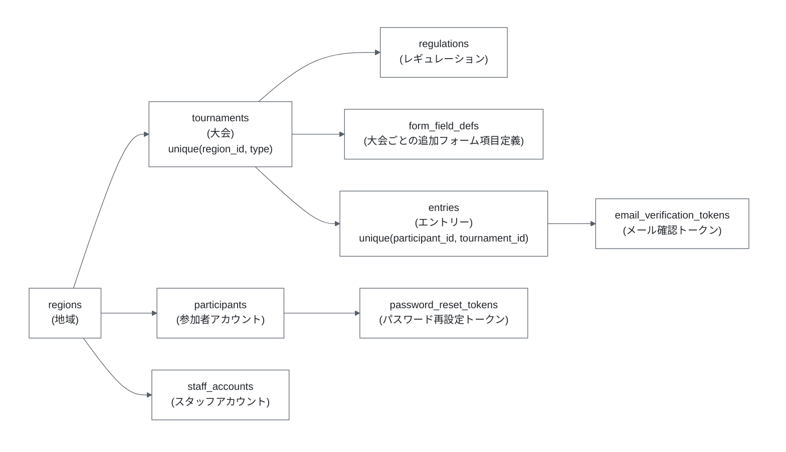
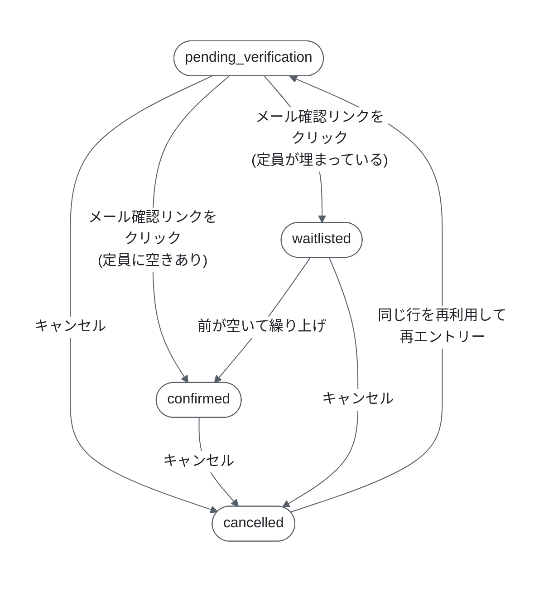

# データベース構造

このドキュメントは、本アプリケーションが Supabase(PostgreSQL)上に持つテーブル・ENUM 型・DB 関数の構造と、その設計意図をまとめたものです。実体は `supabase/migrations/` 配下の SQL であり、このドキュメントはそれを読むための地図です。

- スキーマ定義の正本: `supabase/migrations/*.sql`
- Supabase プロジェクトの作成・マイグレーション適用手順: [`supabase-deployment.md`](./supabase-deployment.md)
- API から見た各テーブルの使われ方: [`api-endpoints.md`](./api-endpoints.md)
- `form_field_defs` テーブルの生成元となる YAML: [`form-generation.md`](./form-generation.md)

## 1. 全体像



基本となるデータモデルの前提は次の通りです。

- **地域(region)** の下に **大会(tournament)** があり、大会は「地域 × 大会種別(最強位 / 新人王)」の組で一意に決まる(`unique (region_id, type)`)。
- **参加者アカウント(participant)** はメールアドレスで一意、かつ1つの地域にひもづく。地域をまたいだ参加はできない。
- **エントリー(entry)** は「participant × tournament」の組ごとに1件のみ(`unique (participant_id, tournament_id)`)。同じ地域内であれば、同じ participant が最強位・新人王の両方に entry を持てる。
- **フォーム項目定義(form_field_defs)** は大会ごとに YAML から展開して保存する。フロントエンドはこれを読んでフォームを動的生成する。

## 2. ENUM 型

`supabase/migrations/0001_init.sql` で定義しています。

| 型名 | 値 | 用途 |
| --- | --- | --- |
| `tournament_type` | `saikyoi` / `shinjinou` | 大会種別(最強位 / 新人王)。URL のスラッグとしてもそのまま使われる |
| `entry_status` | `pending_verification` / `confirmed` / `waitlisted` / `cancelled` | エントリーのステータス |
| `staff_role` | `regional` / `general` | スタッフの権限(地域スタッフ / 統括スタッフ) |

`tournament_type` と `entry_status` は `packages/shared/src/schemas/tournament.ts` / `entry.ts` の Zod enum と、`staff_role` は `schemas/staff.ts` と1対1で対応します。**DB 側の ENUM に値を足す場合は、必ず対応する Zod スキーマも同時に更新してください**(Zod 側は API 応答を `parse()` で検証しているため、DB にだけ値を足すと実行時に検証エラーになります)。

### entry_status の遷移



- `pending_verification` → `confirmed` / `waitlisted` は DB 関数 `confirm_entry_by_token()` が行う。
- `cancelled` への遷移は DB 関数 `cancel_own_entry()` が行う。
- `waitlisted` → `confirmed`(繰り上げ)は DB 関数 `promote_next_waitlisted_entry()` が行う。
- `cancelled` からの再エントリーは新しい行を作らず、`unique (participant_id, tournament_id)` 制約のため**既存の行を再利用して上書き**する(`apps/backend/src/lib/entries.ts` の `createEntry()`)。

## 3. テーブル定義

### regions — 地域

| カラム | 型 | 制約 | 説明 |
| --- | --- | --- | --- |
| `id` | uuid | PK, default `gen_random_uuid()` | |
| `slug` | text | unique, not null | URL に使う識別子(例: `kanto`)。`/{regionSlug}/{tournamentSlug}/entry` の第1セグメント |
| `name` | text | not null | 表示名 |

現時点で regions を作成・編集する API はありません。Supabase 上で直接投入する運用です。

### tournaments — 大会

| カラム | 型 | 制約 | 説明 |
| --- | --- | --- | --- |
| `id` | uuid | PK | |
| `region_id` | uuid | not null, FK → `regions.id` | |
| `type` | tournament_type | not null | 最強位 / 新人王 |
| `name` | text | not null | 大会名 |
| `capacity` | integer | nullable | 定員。**`null` は「定員無制限」を意味する**(0 ではない) |
| `entry_opens_at` | timestamptz | not null | エントリー開始日時 |
| `entry_closes_at` | timestamptz | not null | エントリー終了日時 |
| `created_at` | timestamptz | not null, default `now()` | |

- `unique (region_id, type)`: 1つの地域につき、各大会種別は1大会まで。この制約があるため `/{regionSlug}/{tournamentSlug}` の組から大会を一意に引ける。
- `capacity` が `null` のときは定員チェック自体を行いません(`confirm_entry_by_token()` / `promote_next_waitlisted_entry()` の両方で `v_capacity is not null` を条件にしている)。
- エントリー期間の判定は `packages/shared/src/logic/entry-period.ts` の `isWithinEntryPeriod()` に集約されており、バックエンド(API での拒否)とフロントエンド(UI の非表示)で同じ関数を共有しています。

### regulations — レギュレーション

| カラム | 型 | 制約 | 説明 |
| --- | --- | --- | --- |
| `id` | uuid | PK | |
| `tournament_id` | uuid | not null, FK → `tournaments.id` | |
| `label` | text | not null | 表示ラベル |
| `priority_starts_at` | timestamptz | nullable | 優先エントリー期間の開始 |
| `priority_ends_at` | timestamptz | nullable | 優先エントリー期間の終了 |
| `display_order` | integer | not null, default 0 | 表示順 |

- `unique (id, tournament_id)`: 一見冗長ですが、これは `entries` 側の複合外部キー `foreign key (regulation_id, tournament_id) references regulations (id, tournament_id)` を張るために必要です。この複合 FK により、**ある大会のエントリーが別の大会のレギュレーションを参照することが DB レベルで不可能**になります。
- 優先期間の判定ロジックは `packages/shared/src/logic/regulation-eligibility.ts` の `isRegulationSelectionAllowed()`。「いずれかのレギュレーションの優先期間が現在アクティブなら、そのレギュレーションしか選べない。アクティブなものが1つもなければ全て選べる」という規則です。
- `priority_starts_at` / `priority_ends_at` は**両方揃っているときだけ**優先期間として扱われます(片方だけ設定されている行は優先期間なしと同じ扱い)。

### form_field_defs — 大会ごとの追加フォーム項目定義

| カラム | 型 | 制約 | 説明 |
| --- | --- | --- | --- |
| `id` | uuid | PK | |
| `tournament_id` | uuid | not null, FK → `tournaments.id` | |
| `field_key` | text | not null | 項目キー。`entries.custom_field_values` の JSON キーになる |
| `label` | text | not null | 画面上のラベル |
| `field_type` | text | not null, check in (`checkbox`, `radio`, `textarea`) | 入力形式 |
| `required` | boolean | not null, default false | 必須かどうか |
| `options` | jsonb | nullable | 選択肢の文字列配列。YAML で `options` を省略した項目(単独チェックボックスなど)だけが `null` になります。`checkbox` / `textarea` でも `options` が書かれていれば(空配列であっても)`toFormFieldDefRows()` がその配列をそのまま保存します |
| `display_order` | integer | not null, default 0 | 表示順(YAML の記述順がそのまま入る) |

- `unique (tournament_id, field_key)`: 同一大会内で項目キーは重複不可。
- `field_type` は ENUM ではなく **text + CHECK 制約**です。そのため TypeScript 側では DB 境界で `string` として受け、`toFormFieldDef()`(`apps/backend/src/lib/form-field-defs.ts`)が Zod でユニオン型に絞り込みます。
- このテーブルの行は手で INSERT せず、`PUT /api/form-definitions/:tournamentId` 経由で YAML から一括同期します。詳細は [`form-generation.md`](./form-generation.md)。

### participants — 参加者アカウント

| カラム | 型 | 制約 | 説明 |
| --- | --- | --- | --- |
| `id` | uuid | PK | |
| `region_id` | uuid | not null, FK → `regions.id` | 所属地域 |
| `email` | text | not null, **unique(全体)** | ログイン ID |
| `password_hash` | text | not null | PBKDF2-SHA256 ハッシュ。`{16バイトのソルト}:{32バイトのハッシュ}` を hex 化してコロンで連結した形式(10万回反復) |
| `created_at` | timestamptz | not null, default `now()` | |

- `email` は地域ごとではなく**システム全体で一意**です。そのため、ある参加者が別地域の大会にエントリーしようとすると `createEntry()` が 409(`already registered in another region`)を返します。
- Supabase Auth ではなく自前のテーブルでアカウントを管理しています。パスワードのハッシュ化・検証は `apps/backend/src/lib/password.ts`(Web Crypto の PBKDF2)。Cloudflare Workers は Node.js ランタイムではないため、Node 依存のライブラリは使えません。
- 既存メールアドレスでの再エントリー時は**パスワード照合を必須**にしています。これがないと、メールアドレスを知っている第三者が他人のアカウントにエントリーをぶら下げられてしまいます。

### entries — エントリー

| カラム | 型 | 制約 | 説明 |
| --- | --- | --- | --- |
| `id` | uuid | PK | |
| `participant_id` | uuid | not null, FK → `participants.id` | |
| `tournament_id` | uuid | not null, FK → `tournaments.id` | |
| `name` | text | not null | 氏名(非公開) |
| `furigana` | text | not null | ふりがな(非公開) |
| `display_name` | text | not null | 公開エントリーリストに載る掲載名 |
| `regulation_id` | uuid | not null | 選択したレギュレーション |
| `free_text` | text | nullable | 自由記述 |
| `custom_field_values` | jsonb | not null, default `'{}'` | 追加フォーム項目の回答。`{ field_key: string \| string[] }` |
| `status` | entry_status | not null, default `pending_verification` | |
| `waitlist_position` | integer | nullable | キャンセル待ちの順位。`waitlisted` 以外では `null` |
| `email_verified_at` | timestamptz | nullable | メール確認完了時刻 |
| `cancelled_at` | timestamptz | nullable | キャンセル時刻 |
| `created_at` | timestamptz | not null, default `now()` | |
| `updated_at` | timestamptz | not null, default `now()` | トリガ `entries_set_updated_at` が UPDATE のたびに更新 |

制約・インデックス:

- `unique (participant_id, tournament_id)`: 1参加者につき1大会1エントリー。キャンセル後の再エントリーがこの行を再利用する理由でもあります。
- `foreign key (regulation_id, tournament_id) references regulations (id, tournament_id)`: 前述の複合 FK。
- `entries_tournament_id_created_at_idx`(`0005`): `(tournament_id, created_at)` の**部分インデックス**で、`status in ('confirmed', 'waitlisted', 'cancelled')` の行だけを対象にします。公開エントリーリスト API(`GET /api/tournaments/:tournamentId/entry-list`)が読む行だけを含むため、インデックスが小さく保たれます。既存の unique インデックスは `(participant_id, tournament_id)` で `tournament_id` が先頭列ではないため、この用途には使えません。

`waitlist_position` について:

- 1 始まりの連番で、**常に隙間なく詰められている**ことが不変条件です。`cancel_own_entry()` は waitlisted な行をキャンセルする際、後ろの行を1つずつ前に詰めます。
- この不変条件があるため、`confirm_entry_by_token()` は「次の順位 = 現在の waitlisted 件数 + 1」という単純な計算で衝突しない順位を割り当てられます。

### email_verification_tokens — メール確認トークン

| カラム | 型 | 制約 | 説明 |
| --- | --- | --- | --- |
| `id` | uuid | PK | |
| `entry_id` | uuid | not null, FK → `entries.id` | |
| `token_hash` | text | not null, unique | 生トークンの SHA-256(hex) |
| `expires_at` | timestamptz | not null | 有効期限(発行から24時間) |
| `used_at` | timestamptz | nullable | 使用済み時刻。非 null なら再利用不可 |

- **生トークンは DB に保存しません。** `apps/backend/src/lib/token.ts` が 32 バイトの乱数を hex 化したものをメールに載せ、DB には SHA-256 ハッシュだけを保存します。検証時も受け取ったトークンをハッシュ化して引き当てます。
- `used_at` を立てることで使い回しを防ぎます(ワンタイム)。
- `cancel_own_entry()` はキャンセル時に未使用トークンを `used_at = now()` で**焼き捨て**ます。これがないと、キャンセル後にメールボックスに残っている確認リンクを踏むことでキャンセル済みエントリーが復活してしまいます。

### password_reset_tokens — パスワード再設定トークン

| カラム | 型 | 制約 | 説明 |
| --- | --- | --- | --- |
| `id` | uuid | PK | |
| `participant_id` | uuid | not null, FK → `participants.id` | |
| `token_hash` | text | not null, unique | |
| `expires_at` | timestamptz | not null | |
| `used_at` | timestamptz | nullable | |

スキーマだけ先行して定義されており、これを使うパスワード再設定フロー(Task 5-5)は未実装です。

### staff_accounts — スタッフアカウント

| カラム | 型 | 制約 | 説明 |
| --- | --- | --- | --- |
| `id` | uuid | PK | |
| `email` | text | not null, unique | |
| `password_hash` | text | not null | participants と同じ PBKDF2 形式 |
| `role` | staff_role | not null | `regional` / `general` |
| `region_id` | uuid | nullable, FK → `regions.id` | `regional` のときの担当地域 |
| `tournament_type` | tournament_type | nullable | `regional` のときの担当大会種別 |
| `created_at` | timestamptz | not null, default `now()` | |

- `general`(統括スタッフ)は `region_id` / `tournament_type` が `null` で、全地域・全大会にアクセスできます。
- `regional`(地域スタッフ)は `(region_id, tournament_type)` の組が担当範囲で、その大会のエントリーしか閲覧できません。この範囲チェックは `apps/backend/src/middleware/staff-auth.ts` が担当します。
- スタッフアカウントを作成する API はありません。Supabase 上で直接 INSERT する運用です(`password_hash` の生成方法は [`supabase-deployment.md`](./supabase-deployment.md) を参照)。

## 4. アクセス制御(RLS と権限)

`0001_init.sql` の末尾で、全テーブルに対して次を実行しています。

```sql
alter table <各テーブル> enable row level security;
revoke all on all tables in schema public from anon, authenticated;
grant select, insert, update, delete on all tables in schema public to service_role;
```

設計方針:

- **`anon` / `authenticated` ロールからは一切アクセスできません。** RLS を有効化した上で、そもそも権限自体を剥奪しています(RLS ポリシーは1つも定義していないため、仮に権限が残っていても全行が不可視になります)。
- **DB へのアクセス経路は Cloudflare Workers 上の Hono API のみ**です。バックエンドは `SUPABASE_SERVICE_ROLE_KEY`(`service_role` ロール)で Supabase に接続します(`apps/backend/src/lib/db.ts`)。
- したがって、**認可はすべてアプリケーション層(Hono のミドルウェアと `lib/` の関数)の責務**です。RLS ポリシーに認可を委ねてはいません。新しいクエリを追加する際は、「誰がこの行を読んでよいか」をアプリ側で必ず絞り込んでください。
  - 例: マイページ系のクエリは `.eq('participant_id', c.get('participantId'))` を必ず付け、他人のエントリーが存在しないエントリーと区別できないようにしています。
- `SUPABASE_SERVICE_ROLE_KEY` は RLS を貫通する強い鍵です。フロントエンドには決して渡さず、Worker の secret としてのみ扱ってください。

## 5. DB 関数(PL/pgSQL)

Supabase 経由の複数クエリはそれぞれ別トランザクションになるため、**アトミック性や排他制御が必要な処理は PL/pgSQL 関数にまとめ、`db.rpc()` から1回で呼び出す**方針を取っています。PL/pgSQL の関数本体は呼び出し文の暗黙トランザクション内で実行されるため、関数内の全ステートメントがまとめてコミット/ロールバックされます。

いずれの関数も `revoke all ... from public` / `grant execute ... to service_role` が付いており、service_role からしか実行できません。

| 関数 | 定義ファイル | 呼び出し元 | 役割 |
| --- | --- | --- | --- |
| `sync_form_field_defs(uuid, jsonb)` | `0002` | `lib/form-definitions.ts` | 大会のフォーム項目定義を全削除+一括挿入で置き換える |
| `confirm_entry_by_token(text)` | `0003` → `0008` で再定義 | `lib/entry-confirmation.ts` | 確認トークンでエントリーを確定 / キャンセル待ちに載せる |
| `promote_next_waitlisted_entry(uuid)` | `0004` → `0007` で再定義 | `lib/waitlist.ts` | キャンセル待ち先頭を繰り上げる |
| `cancel_own_entry(uuid, uuid)` | `0006` | `lib/entries.ts` | 参加者自身のエントリーをキャンセルする |

### sync_form_field_defs(p_tournament_id, p_rows)

指定大会の `form_field_defs` を、渡された JSON 配列の内容で丸ごと置き換えます。

- 大会行を `for update` でロックしてから delete → insert するため、(1) 挿入に失敗しても削除だけが残ることがなく、(2) 同一大会への同時アップロードが直列化され、2つの定義がマージされた中途半端な状態になりません。
- 大会が存在しない場合は SQLSTATE `P0002` を raise します。TypeScript 側はこれを `TournamentNotFoundError` に変換し、API は 404 を返します。

### confirm_entry_by_token(p_token_hash)

確認トークンのハッシュを受け取り、対応するエントリーを `confirmed` か `waitlisted` にして、そのステータスを返します。

処理順:

1. トークン行を `for update of evt` でロックしつつ取得。未知 / 使用済み / 期限切れなら SQLSTATE `P0003` を raise。
2. 大会行を `for update` でロック(`capacity` も同時に取得)。
3. **ロック取得後に**エントリーの `status` を読み直し、`pending_verification` でなければ `P0003` を raise(`0008` で追加)。
4. `confirmed` 件数を数え、`capacity` に空きがあれば `confirmed`、なければ `waitlisted`(順位 = 現在の waitlisted 件数 + 1)。
5. エントリーと トークン(`used_at`)を更新。

ステータスをロック取得後に読み直すのが重要な点です。`cancel_own_entry()` は同じ大会行ロックを保持したままエントリーを `cancelled` にするため、先に走り出した確認処理はここでブロックされ、ロック取得後にキャンセルを観測できます。これがないと、キャンセルと競合した再エントリーが挿入した新しいトークンによって、キャンセル済みエントリーが復活し得ます。

### promote_next_waitlisted_entry(p_tournament_id)

`waitlist_position` が最小の waitlisted エントリーを1件 `confirmed` に繰り上げ、`(entry_id, participant_email)` を返します。繰り上げる相手がいなければ何も返しません。

- 大会行を `for update` でロックしてから **定員を再チェック**します(`0007` で追加)。`cancelOwnEntry()` はキャンセルをコミットしてからこの関数を呼ぶため、その隙間に `pending_verification` のエントリーが空席へ確定してしまう可能性があります。再チェックがないと同じ席を二重に配ってしまい、定員超過になります。
- 空席がすでに埋まっていた場合は、キューを一切触らずに何も返しません(呼び出し側はこれを「繰り上げ対象なし」と同じに扱います)。

### cancel_own_entry(p_entry_id, p_participant_id)

参加者自身のエントリーをキャンセルし、`(previous_status, entry_tournament_id)` を返します。

- `p_participant_id` を条件に含めるため、**他人のエントリーは「存在しない」と同じ結果(行なし)** になります。API はどちらも 404 を返し、両者を区別できません。
- 未使用の確認トークンを焼き捨てます。
- ロック取得順は `confirm_entry_by_token()` と揃えて「トークン行 → 大会行」。順序を揃えることでデッドロックを避けています。
- キャンセル前のステータスを大会行ロックの下で読み、同時に上書きするため、同じ `confirmed` エントリーへの同時キャンセルが両方とも繰り上げを発火させることはありません。
- `waitlisted` な行をキャンセルした場合は、後続の `waitlist_position` を1つずつ詰めます。
- すでに `cancelled` の行に対しては何もせず、`cancelled` を返します(冪等)。

### マイグレーションを修正するときの注意

`supabase db push` は各バージョンを一度しか適用しません。そのため、**適用済みのマイグレーションファイルを直接書き換えても、既存環境には反映されません**。関数の挙動を変更する場合は、`0007` / `0008` のように**新しい番号のファイルで `create or replace function` し直す**のが本リポジトリの流儀です。その際は変更しない部分も含めて関数全体を書き直すことになるため、元ファイルからの差分をコメントに明記してください。

## 6. マイグレーション一覧

| ファイル | 内容 |
| --- | --- |
| `0001_init.sql` | ENUM 型・全テーブル・`set_updated_at` トリガ・RLS/権限設定 |
| `0002_sync_form_field_defs_fn.sql` | `sync_form_field_defs()` |
| `0003_confirm_entry_by_token_fn.sql` | `confirm_entry_by_token()` 初版 |
| `0004_promote_next_waitlisted_entry_fn.sql` | `promote_next_waitlisted_entry()` 初版 |
| `0005_entries_tournament_id_created_at_idx.sql` | 公開エントリーリスト用の部分インデックス |
| `0006_cancel_own_entry_fn.sql` | `cancel_own_entry()` |
| `0007_promote_next_waitlisted_entry_capacity.sql` | 繰り上げ時の定員再チェックを追加(`0004` を再定義) |
| `0008_confirm_entry_by_token_entry_status.sql` | 確定前のステータス再確認を追加(`0003` を再定義) |
