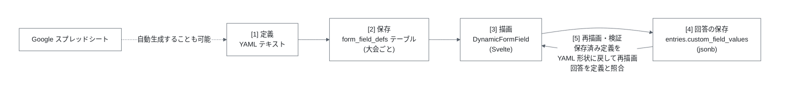
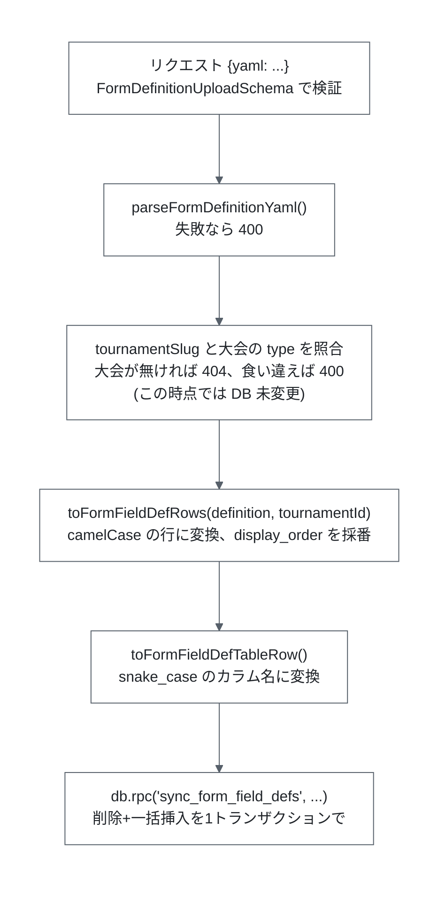
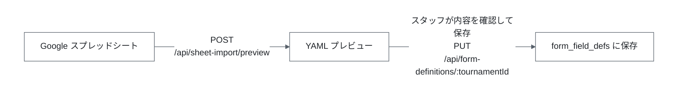

# YAML からのフォーム自動生成ロジック

大会ごとに異なる「追加のフォーム項目」を、YAML 定義から DB に展開し、フロントエンドで動的にレンダリングする仕組みについてまとめます。

- YAML スキーマとパーサの正本: `packages/shared/src/schemas/form-definition.ts`
- 回答値の検証: `packages/shared/src/logic/custom-field-values.ts`
- スプレッドシートからの YAML 生成: [`google-sheets-integration.md`](./google-sheets-integration.md)
- `form_field_defs` テーブルの定義: [`database-schema.md`](./database-schema.md)

## 1. 全体像

氏名・ふりがな・掲載名・自由記述といった**全大会共通の項目**はハードコードされています。それ以外の大会固有の設問(「Tシャツのサイズ」「懇親会に参加しますか」など)を YAML で定義し、DB に展開してフォームを動的生成します。



登場する型は3つあり、それぞれ役割が違います。混同しやすいので最初に整理します。

| 型 | 定義場所 | 形 | 用途 |
| --- | --- | --- | --- |
| `FormFieldDefYaml` | `schemas/form-definition.ts` | `{key, label, type, required, options?}` | **YAML に書かれる形**。`DynamicFormField.svelte` が描画に使う形でもある |
| `FormFieldDefRow` | 同上 | `{tournamentId, fieldKey, label, fieldType, required, options, displayOrder}` | DB 保存用の中間形(camelCase) |
| `FormFieldDef` | 同上 | `{fieldKey, label, fieldType, required, options, displayOrder}` | **API レスポンスの形**。保存済み定義をクライアントに返すときの形 |

`FormFieldDef` → `FormFieldDefYaml` の逆変換が `toFormFieldDefYaml()` です。保存済みのエントリーを編集画面で再描画するときに使います。

## 2. YAML のスキーマ

```yaml
tournamentSlug: saikyoi
fields:
  - key: t_shirt_size
    label: Tシャツのサイズ
    type: radio
    required: true
    options:
      - S
      - M
      - L
  - key: agree_rules
    label: 大会規約に同意します
    type: checkbox
    required: true
  - key: allergies
    label: アレルギーの有無(ある場合は内容をご記入ください)
    type: textarea
    required: false
```

### トップレベル

| キー | 型 | 説明 |
| --- | --- | --- |
| `tournamentSlug` | `saikyoi` / `shinjinou` | 対象の**大会種別**のスラッグ(`tournaments.type` および URL の `/{regionSlug}/{tournamentSlug}` の第2セグメントと同じ値)。保存先の大会そのものは URL の `:tournamentId` で決まり、このスラッグは保存時にその大会の種別と一致するか検証されます(後述) |
| `fields` | array | 項目定義の配列。**記述順がそのまま `display_order` になります** |

`fields` 内の `key` に重複があると `FormDefinitionYamlSchema` の `.refine()` が「フィールドキーが重複しています」で弾きます。

### 各フィールド

| キー | 型 | 必須 | 説明 |
| --- | --- | --- | --- |
| `key` | string | ✅ | 正規表現 `^[a-z][a-z0-9_]*$`。`custom_field_values` の JSON キーになる |
| `label` | string | ✅ | 画面表示用のラベル。日本語可 |
| `type` | `checkbox` / `radio` / `textarea` | ✅ | 入力形式 |
| `required` | boolean | | 省略時は `false` |
| `options` | string[] | `radio` のみ✅ | 選択肢 |

スキーマは `type` をタグとする **discriminated union** で、型ごとに `options` の要求が違います。

- `radio`: `options` は**必須かつ1件以上**。選択肢のないラジオボタンは選びようがないためです。
- `checkbox`: `options` は任意で、**省略だけでなく空配列も許可されます**。描画側(`DynamicFormField.svelte`)は「指定されているか」ではなく `options.length > 0`、つまり**非空かどうか**で分岐します。したがって**1件以上あれば複数選択のチェックボックス群、省略時または空配列なら単独のブールチェックボックス**(「規約に同意します」など)になります。
- `textarea`: `options` は任意ですが、実際には使いません(自由記述のため)。

`key` の命名規則が厳しい(小文字英数字とアンダースコアのみ)のは、これが JSON のキーおよび HTML の `id` / `name` 属性としてそのまま使われるためです。

## 3. パース(`parseFormDefinitionYaml`)

```ts
export function parseFormDefinitionYaml(yamlText: string): FormDefinitionYaml {
  return FormDefinitionYamlSchema.parse(parseYaml(yamlText));
}
```

`yaml` パッケージで文字列を JS の値に変換し、そのまま Zod で検証します。検証エラーは `ZodError` として送出され、API 層で 400 に変換されます。

この関数と各スキーマを `packages/shared` に置いているのは、**YAML の項目定義がバックエンドとフロントエンドの共通の契約だから**です。片側だけで定義を持つと、項目の型や必須条件がずれても気づけません。

ただし**現時点で YAML をパース・検証しているのはバックエンドだけ**です(`apps/backend/src/routes/form-definitions.ts` と `apps/backend/src/lib/sheet-to-form-definition.ts`)。フロントエンドは YAML を扱わず、`@regional-quiz/shared` からは**項目定義の型 `FormFieldDefYaml` と変換関数 `toFormFieldDefYaml` のみを import**し、API から受け取った項目定義を `DynamicFormField.svelte` の描画に使っています。

将来フロントエンドで YAML のプレビューやクライアント側バリデーションを行う場合も、この `packages/shared` の定義を import してください。バックエンドとフロントエンドで別々にスキーマを定義してはいけません。

## 4. 保存(`PUT /api/form-definitions/:tournamentId`)



### リクエストが「パース済み JSON」ではなく「生の YAML 文字列」である理由

`FormDefinitionUploadSchema` は `{yaml: string}` です。スタッフが画面で見て確認した YAML テキストそのものを送るため、プレビューした内容と保存される内容が確実に一致します。パースはサーバ側で行います。

### `display_order` の決まり方

`toFormFieldDefRows()` は `definition.fields.map((field, index) => ...)` として **配列のインデックスをそのまま `displayOrder` に入れます**。YAML の記述順 = 画面の表示順です。YAML 側に順序を指定するキーはありません。

### 置き換えは「全削除 + 一括挿入」

`sync_form_field_defs()`(`supabase/migrations/0002_...`)は、既存行の差分更新ではなく**その大会の全行を削除してから新しい行を一括挿入**します。`form_field_defs.id` を外部キーで参照しているテーブルは他に無いため、差分更新と正味の結果は同じです。

この処理は PL/pgSQL 関数にまとめられており、関数本体は呼び出し文の暗黙トランザクション内で走ります。したがって:

- 挿入が失敗した場合、削除もロールバックされます。**「フォーム定義が消えたまま」という状態にはなりません。**
- 大会行を `for update` でロックするため、同一大会への同時アップロードが直列化されます。2つのアップロードが両方とも削除を通過し、互いに素な項目集合を挿入してしまう(=マージされた壊れた定義になる)ことがありません。

大会が存在しない場合は SQLSTATE `P0002` が raise され、`TournamentNotFoundError` を経て 404 になります。

### `tournamentSlug` による取り違え検証

保存先の大会を決めるのは URL パスの `:tournamentId` で、YAML の `tournamentSlug` ではありません。ただし `syncFormFieldDefs()` は**削除+挿入を走らせる前に**、`:tournamentId` の大会の `type` を引いて `tournamentSlug` と突き合わせます。食い違っていれば `TournamentSlugMismatchError` を送出し、API は 400 を返します。**この時点では DB に何も書き込んでいないため、対象大会の既存のフォーム定義はそのまま残ります。**

これで防げるのは**大会種別の取り違え**(最強位の定義を新人王に保存してしまう等)だけです。`tournamentSlug` は地域を含まないため、**同じ種別の別地域の大会に保存してしまう取り違えは検出できません**。完全に防ぐには YAML に `regionSlug` を持たせて `(regionSlug, tournamentSlug)` の組で突き合わせる必要があります(issue #62 の案2)。

スプレッドシート取り込み画面(`SheetImportPanel.svelte`)は大会スラッグを手入力させず、**編集中の大会の `type` をそのまま YAML に埋め込みます**。手入力の誤りがそもそも発生しないため、この検証で 400 になるのは主に「別の大会向けに作った YAML を手動でアップロードした」ケースです。

## 5. 描画(`DynamicFormField.svelte`)

`apps/frontend/src/lib/components/DynamicFormField.svelte` が `FormFieldDefYaml` を1件受け取り、対応する入力要素を1つ描画します。

```svelte
{#each fields as field (field.key)}
  <DynamicFormField
    {field}
    value={valueFor(field.key)}
    onChange={value => setValue(field.key, value)}
  />
{/each}
```

Props は `{field, value, onChange}` の3つで、状態は親が持ちます(制御コンポーネント)。

### 型ごとの描画

| `type` | `options` | 描画 |
| --- | --- | --- |
| `textarea` | — | `<label>` + `<textarea>` |
| `radio` | 必須 | `<fieldset><legend>` + 各選択肢の `<input type="radio">` |
| `checkbox` | 1件以上 | `<fieldset><legend>` + 各選択肢の `<input type="checkbox">` |
| `checkbox` | 省略または空配列(`[]`) | ラベル付きの単独 `<input type="checkbox">` |

複数選択のグループは `<fieldset>` / `<legend>` でまとめており、単なる `<div>` + `<label>` ではありません。これはスクリーンリーダーが「グループのラベル」を各選択肢に関連付けられるようにするためです。

### 値の表現

コンポーネントが扱う値の型は全項目タイプで `string | string[]` に統一されています。

- `radio` / `textarea`: `string`。未選択・未入力は空文字列。
- 複数選択チェックボックス: `string[]`。選択された選択肢の値が入ります。
- **単独ブールチェックボックス**: これも `string[]` で表し、**チェック時は `[field.key]`(自分自身のキー1件の配列)、未チェック時は `[]`** とします。`true` / `false` にしないのは、値の型を全タイプで揃えて `Record<string, string | string[]>` 一本で扱えるようにするためです。

### 必須チェックボックス群の扱い

「複数の選択肢のうち最低1つ」を表す HTML の標準機能はありません。そこで、**グループ内のどれも選択されていない間だけ全チェックボックスに `required` を付け、1つでも選択されたら全部から外す**、という方法を取っています。

```svelte
required={field.required && !hasCheckboxSelection}
```

こうすると、未選択のときはブラウザの制約検証が発火し、1つ選べば満たされた扱いになります。

## 6. 回答値の保存と検証

回答は `entries.custom_field_values`(jsonb)に `{ field_key: string | string[] }` の形で保存されます。共有型としては `CustomFieldValues` です。

**エントリー編集 API(`PATCH /api/mypage/entries/:entryId`)では**、サーバはクライアントから送られた回答をそのまま信用せず、`findCustomFieldValuesError()`(`packages/shared/src/logic/custom-field-values.ts`)がその大会の `form_field_defs` と照合します。この照合がないと、API を直接叩くことで「描画されたフォームからは絶対に生成し得ない回答」を保存できてしまいます。一方、新規エントリー API(`POST /api/tournaments/:tournamentId/entries`)の `createEntry()` はこの照合を行わないため、回答が定義どおりであることを保証できるのは編集 API に限られます(後述の「現状の注意点」を参照)。

検証項目:

| チェック | エラーメッセージ |
| --- | --- |
| 定義に無いキーが含まれていない | `unknown custom field: {key}` |
| `checkbox` の値が配列である | `custom field expects a list of values: {key}` |
| `checkbox` 以外の値が配列でない | `custom field expects a single value: {key}` |
| 必須項目が空でない | `custom field is required: {key}` |
| 選択肢が定義内の値である | `custom field has an unknown option: {key}` |

補足:

- キーが存在しない場合は「空の回答」として扱われ、必須項目のときだけエラーになります。
- `textarea` は自由記述なので選択肢の照合をスキップします。
- 単独ブールチェックボックス(`options` が**省略されているか空配列**の `checkbox`)は、「自分のキー1つだけを選択肢に持つ」ものとして照合されます。つまり `[field.key]` か `[]` 以外は弾かれます。
- `checkbox` にスカラー値が来た場合は、選択肢の照合自体は通ってしまうものの弾いています。保存できてしまうと、エントリーを開き直したときに描画側(配列しか見ない)が選択を認識できず、回答が黙って消えたように見えるためです。

> **現状の注意点**: この検証を呼んでいるのは `updateOwnEntry()`(`PATCH /api/mypage/entries/:entryId`)だけで、**新規エントリー時の `createEntry()`(`POST /api/tournaments/:tournamentId/entries`)では呼ばれていません**。そのため新規エントリーでは、API を直接叩けば定義に無い項目や選択肢外の値を保存できてしまいます(`EntryInputSchema` の `z.record()` は形だけを見て、大会のフォーム定義とは照合しません)。項目を追加する際はこの非対称性に注意してください。

## 7. 保存済み定義からのフォーム再構築

エントリー編集画面(`/mypage/entries/[entryId]/edit`)では、保存済みの定義から**同じフォームを描画し直します**。

API が返す形は `FormFieldDef`(`fieldKey` / `fieldType` の camelCase)ですが、`DynamicFormField` が受け取るのは YAML の形(`key` / `type`)です。この差を埋めるのが `toFormFieldDefYaml()` です。

```svelte
const fields = $derived(data.entry.formFieldDefs.map(toFormFieldDefYaml));
```

`toFormFieldDefYaml()` では `radio` だけ特別扱いしています。`FormFieldDefYamlSchema` 上 `radio` の `options` は必須ですが、DB のカラムは nullable です。YAML 経由では起こり得ない状態ですが、DB を直接編集された場合などに備えて例外を投げずに空配列へフォールバックします。

同じ変換は `GET /api/staff/entries/:entryId` が返す `formFieldDefs` にも使えます。こちらはスタッフ画面が `custom_field_values` の生キー(`t_shirt_size` など)ではなく、人が読めるラベルで回答を表示するために使われます。

## 8. スプレッドシートからの YAML 自動生成

YAML は手書きもできますが、地域スタッフが記入した Google スプレッドシートから生成することもできます。



`sheetRowsToYaml()`(`apps/backend/src/lib/sheet-to-form-definition.ts`)が、`A2:E` の5列(`key`, `label`, `type`, `required`, `options`)を `FormFieldDefYamlSchema` で検証しながら YAML 文字列に変換します。

- `type` 列は日本語ラベル(`チェックボックス` / `ラジオボタン` / `自由記述`)を内部の型に変換します。
- `required` 列は `必須` という文字列のときだけ `true` になります。
- `options` 列はカンマ区切りで、前後の空白は除去し、空要素は捨て、重複があればエラーにします。
- `key` は**行の位置やラベルから自動生成せず、スタッフが A 列に手入力した値をそのまま使います**。行の並び替えや挿入をしてもキーが変わらないようにするためです。キーが変わると、既存エントリーの `custom_field_values` が別の項目の回答として黙って読み替えられてしまいます。

詳細(API キーの設定、スプレッドシートの共有設定、エラーの切り分け)は [`google-sheets-integration.md`](./google-sheets-integration.md) を参照してください。

## 9. 新しい入力形式を追加するときの手順

`checkbox` / `radio` / `textarea` 以外の形式(例: `select`、`date`)を追加する場合、以下をすべて更新する必要があります。**どれか1つでも漏れると実行時エラーになります。**

1. `supabase/migrations/` に新しいマイグレーションを追加し、`form_field_defs.field_type` の CHECK 制約に値を足す。
2. `packages/shared/src/schemas/form-definition.ts`
   - `FormFieldTypeSchema` の enum に値を足す。
   - `FormFieldDefYamlSchema` の discriminated union にバリアントを足し、`options` の要否を決める。
   - `toFormFieldDefYaml()` に、必要なら `radio` と同様の特別扱いを足す。
3. `packages/shared/src/logic/custom-field-values.ts` の `findCustomFieldValuesError()` に、値の形(配列かスカラーか)と選択肢照合の要否を追加する。
4. `apps/frontend/src/lib/components/DynamicFormField.svelte` に描画分岐を追加する。
5. スプレッドシート取り込みを使う場合は、`apps/backend/src/lib/sheet-to-form-definition.ts` の `TYPE_LABELS` に日本語ラベルを追加し、スプレッドシートのテンプレートのプルダウンも更新する。

## 10. 関連ファイル一覧

| ファイル | 役割 |
| --- | --- |
| `packages/shared/src/schemas/form-definition.ts` | YAML スキーマ、パーサ、3つの型と相互変換 |
| `packages/shared/src/logic/custom-field-values.ts` | 回答値の検証 |
| `apps/backend/src/routes/form-definitions.ts` | `PUT /api/form-definitions/:tournamentId` |
| `apps/backend/src/lib/form-definitions.ts` | `sync_form_field_defs` RPC の呼び出しと snake_case 変換 |
| `apps/backend/src/lib/form-field-defs.ts` | `form_field_defs` 行 → `FormFieldDef` の変換(API 応答用) |
| `apps/backend/src/lib/sheet-to-form-definition.ts` | スプレッドシート → YAML |
| `apps/backend/src/routes/sheet-import.ts` | `POST /api/sheet-import/preview` |
| `apps/frontend/src/lib/components/DynamicFormField.svelte` | 1項目ぶんの入力要素を描画 |
| `apps/frontend/src/lib/components/SheetImportPanel.svelte` | プレビュー → 保存の UI |
| `supabase/migrations/0002_sync_form_field_defs_fn.sql` | 全削除+一括挿入の DB 関数 |
