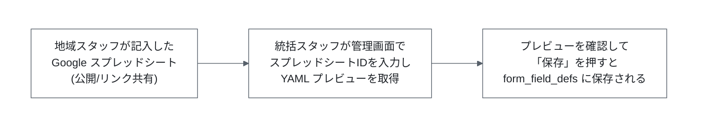

# Google スプレッドシート連携(フォーム定義インポート)

このドキュメントは、地域スタッフが Google スプレッドシートに入力したエントリーフォームのフィールド定義を、大会管理画面から YAML としてプレビュー・取り込む機能(Task 2-3/2-4)についてまとめたものです。実装済みのコード(`apps/backend/src/lib/sheet-to-form-definition.ts` ほか)を基に、仕組み・必要な設定・使い方を記載します。

## 1. 全体像



- スプレッドシートの読み取りは **API キー認証**で行う(サービスアカウントではない)。そのため取り込み対象のスプレッドシートは「リンクを知っている全員が閲覧可」に共有しておく必要がある。
- 「プレビュー」と「保存」は別 API に分かれた 2 段階のフロー。プレビュー段階では DB に何も書き込まれず、YAML 文字列がブラウザに返るだけ。保存段階で初めて `form_field_defs` テーブルに永続化される。
- スプレッドシート取り込みは大会(tournament)本体の CRUD とは別レイヤの機能で、大会作成/編集画面(`/admin/tournaments/new`、`/admin/tournaments/[id]/edit`)に UI として組み込まれている。

> **設計書との差異**: `tasks/task-2-3.md` の初期設計では「サービスアカウント認証」を想定していたが、実装では API キー認証に変更されている(理由は後述)。ドキュメントや今後の設計変更時はこの点に注意すること。

## 2. 関連ファイル

| ファイル | 役割 |
| --- | --- |
| `apps/backend/src/lib/sheet-to-form-definition.ts` | `fetchSheetRows()`(Sheets API v4 呼び出し)・`sheetRowsToYaml()`(行データ→YAML変換) |
| `apps/backend/src/routes/sheet-import.ts` | `POST /api/sheet-import/preview` ルート。統括スタッフ限定 |
| `apps/backend/src/routes/form-definitions.ts` | `PUT /api/form-definitions/:tournamentId`。プレビュー済み YAML を `form_field_defs` に保存(Task 2-2) |
| `apps/backend/src/types/env.ts` | `Bindings.GOOGLE_SHEETS_API_KEY` を定義 |
| `packages/shared/src/schemas/form-definition.ts` | YAML のスキーマ(`FormFieldDefYamlSchema` 等)。バックエンド/フロントエンド共通 |
| `apps/frontend/src/lib/components/SheetImportPanel.svelte` | スプレッドシートID/大会スラッグ入力→プレビュー→保存の UI |
| `apps/frontend/src/routes/admin/tournaments/new/+page.svelte` | 大会新規作成画面。作成成功後は大会編集画面(`SheetImportPanel` 表示)へ遷移する |
| `apps/frontend/src/routes/admin/tournaments/[id]/edit/+page.svelte` | 大会編集画面。常時 `SheetImportPanel` を表示 |

Sheets API 専用の SDK(`googleapis` 等)は使わず、`fetch` で REST エンドポイントを直接呼び出している。YAML の変換には `yaml` パッケージ(`stringify`/`parse`)を使用。

## 3. 認証方式(API キー)

`fetchSheetRows()` のコメントに明記されている通り:

> サービスアカウントではなく API キーで認証するため、対象のスプレッドシートは公開/リンク共有にしておく必要がある。

- 使用するのは Google Sheets API v4 の `spreadsheets.values.get` エンドポイント。
- 呼び出し例: `https://sheets.googleapis.com/v4/spreadsheets/{spreadsheetId}/values/A2:E?key={apiKey}`
- API キーは Cloudflare Workers の Bindings 経由の環境変数 `GOOGLE_SHEETS_API_KEY`(`apps/backend/src/types/env.ts`)として渡す。

このためのトレードオフ:

- **メリット**: サービスアカウントの JSON 鍵管理・スプレッドシートごとの個別共有設定が不要で、地域スタッフ側の運用負荷が低い。
- **デメリット**: 取り込み対象のスプレッドシートを「リンクを知っている全員が閲覧可」にする必要があり、URL(スプレッドシートID)が漏れると誰でも内容を閲覧できてしまう。個人情報や非公開情報を含むシートをこの用途に流用しないよう、地域スタッフへの周知が必要。

## 4. Google Cloud 側の設定

1. **Google Sheets API の有効化**: 対象の Google Cloud プロジェクトで [Google Sheets API](https://console.cloud.google.com/apis/library/sheets.googleapis.com) を有効化する。
2. **API キーの発行**: `APIs & Services > Credentials` から API キーを新規作成する。
   - キーの制限として「API restrictions」で Google Sheets API のみに絞ることを推奨(他の Google API への悪用を防ぐため)。
   - IP アドレス制限は Cloudflare Workers の送信元 IP が固定でないため実質的に使えない。リファラー制限もサーバーサイドからの呼び出しのため効果がない点に注意。
3. **発行したキーを Cloudflare Workers のシークレットとして登録**(手順は後述)。

## 5. スプレッドシートのフォーマット規約

- 取り込み範囲は固定で `A2:E`(1行目はヘッダー行として扱われ、読み飛ばされる)。
- 列は左から順に **`key, label, type, required, options`** の5列固定。

| 列 | 内容 | 例 |
| --- | --- | --- |
| A: key | フィールド識別子。`/^[a-z][a-z0-9_]*$/` に一致する必要がある(小文字英数字とアンダースコアのみ、先頭は英字) | `tshirt_size` |
| B: label | 表示ラベル | `T シャツのサイズ` |
| C: type | `チェックボックス` / `ラジオボタン` / `自由記述` のいずれか | `ラジオボタン` |
| D: required | 文字列 `必須` の場合のみ必須。それ以外(`任意`・空欄等)はすべて任意扱い | `必須` |
| E: options | カンマ区切りの選択肢(各要素は trim され、空要素は除去、重複は不可)。`ラジオボタン` は最低1件必須、`チェックボックス`/`自由記述` は省略可 | `S, M, L, XL` |

C列(type)・D列(required)は Google スプレッドシート側のデータの入力規則(プルダウン)で上記の値のみ選択可能にする運用を想定している(地域スタッフが自由入力するとタイプミスで取り込みに失敗するため)。

シート例(1行目はヘッダー、2行目以降がデータ):

| key | label | type | required | options |
| --- | --- | --- | --- | --- |
| tshirt_size | T シャツのサイズ | ラジオボタン | 必須 | S, M, L, XL |
| has_allergy | アレルギーの有無 | チェックボックス | 任意 | |
| notes | 備考 | 自由記述 | 任意 | |

地域スタッフに配布するテンプレートシートは、この列構成に合わせて作成すること。

### key について

`key`(DB上のフィールド識別子)は地域スタッフがスプレッドシートの A 列に直接入力する。行の並び順や日本語の `label` から自動生成する方式は採用していない(`label` の漢字の読みが一意に定まらず、機械的に意味のある英数字 key を生成する精度に限界があるため)。

エントリーは `custom_field_values` を `key` で紐付けて永続化しているため、**一度保存したフォーム定義の `key` は変更しない**こと。既存の `key` を再利用しつつ行を並べ替えたり、フィールドを追加する場合は新しい `key` を末尾の行に追記したりする分には問題ない。誤って `key` を変更したまま再インポート・保存すると、既存の回答データが別のフィールドに紐付いたように見えてしまう。

## 6. 処理フロー(詳細)

1. 統括スタッフが管理画面(`SheetImportPanel.svelte`)で「大会スラッグ」「スプレッドシートID」を入力し、「YAML プレビュー」を押す。
2. フロントエンドが `POST /api/sheet-import/preview` に `{spreadsheetId, tournamentSlug}`(`packages/shared` の `SheetImportRequestSchema`)を送信。ルートは `requireGeneralStaff()` ミドルウェアで保護されており、統括スタッフ(`role: 'general'`)のみアクセス可能(地域スタッフは 403)。
3. バックエンドの `fetchSheetRows(spreadsheetId, c.env.GOOGLE_SHEETS_API_KEY)` がシートの `A2:E` を取得。ネットワークエラーや Google からの非 2xx レスポンスは、HTTP ステータス(取得できた場合)を保持した `SheetFetchError` として throw される。
4. `sheetRowsToYaml(tournamentSlug, rows)` が各行を YAML 化する。
   - `key` はスプレッドシートの A 列に地域スタッフが入力した値をそのまま使う(5章参照)。
   - `type` は `TYPE_LABELS`(`チェックボックス`→`checkbox`、`ラジオボタン`→`radio`、`自由記述`→`textarea`)で内部の enum に変換。未知の値の場合は `Unknown field type: {値}` を throw。
   - `required` は文字列 `'必須'` との一致で boolean 化(それ以外はすべて `false`)。
   - `options` はカンマ区切り文字列を trim・空要素除去した配列に変換。重複が残っている場合は `Duplicate option values: {値}` を throw。
   - 最後に `FormFieldDefYamlSchema.parse()` で検証(例: `key` が不正な形式、`ラジオボタン` なのに `options` が空、など)。バリデーション失敗時は `ZodError` を throw。
5. 上記で例外が発生した場合のレスポンスは原因によって異なる:
   - `SheetFetchError` でネットワーク障害または Google 側の 5xx → **502**。
   - `SheetFetchError` で Google のレート制限(429)→ **503**。
   - `SheetFetchError` でそれ以外の非 2xx(400/403/404 など、スプレッドシートID誤り・非公開など)、または `sheetRowsToYaml` からの `ZodError`/`Error`(入力起因) → **400**。
   - いずれの場合も `{error: message}` を返す。成功時は `{yaml}` を 200 で返す。
6. プレビューされた YAML を確認し、「保存」を押すと `PUT /api/form-definitions/:tournamentId` に `{yaml: previewYaml}` を送信。
7. 保存 API 側で `parseFormDefinitionYaml()` により再度パース・検証し、`toFormFieldDefRows()` で `form_field_defs` テーブルの行形式に変換した上で Supabase に同期保存する。

## 7. 環境変数・シークレットの登録

`docs/supabase-deployment.md` の手順に倣い、`GOOGLE_SHEETS_API_KEY` も他のシークレットと同様に登録する。

### ローカル開発

`apps/backend/.dev.vars`(gitignore 対象、リポジトリには存在しないため各自作成)に追記する。

```
GOOGLE_SHEETS_API_KEY=<発行したAPIキー>
```

### staging / production(Cloudflare Workers)

```bash
cd apps/backend

# staging
bunx wrangler secret put GOOGLE_SHEETS_API_KEY --env staging

# production
bunx wrangler secret put GOOGLE_SHEETS_API_KEY --env production
```

> `docs/supabase-deployment.md` 6.2 節のシークレット一覧には現時点で `GOOGLE_SHEETS_API_KEY` が含まれていない。新規環境構築時は同節の手順に本キーの登録も追加すること。

## 8. 使い方

このツールは独立した CLI スクリプトではなく、**HTTP API + Web UI** として実装されている。

### Web UI から使う(通常の運用)

1. `bunx wrangler dev`(`apps/backend`)と SvelteKit の dev server(`apps/frontend`)を起動。
2. 統括スタッフでログインし、`/admin/tournaments/new`(新規作成時)または `/admin/tournaments/{id}/edit`(既存大会)を開く。
3. 「スプレッドシート取り込み」パネルで大会スラッグとスプレッドシートIDを入力し「YAML プレビュー」を押す。
4. プレビューされた YAML を確認し、問題なければ「保存」を押す。

### API を直接叩く場合

```bash
curl -X POST http://localhost:8787/api/sheet-import/preview \
  -H 'Content-Type: application/json' \
  -H 'Cookie: staff_session=<統括スタッフのJWT>' \
  -d '{"spreadsheetId": "<スプレッドシートID>", "tournamentSlug": "example-tournament"}'
```

## 9. 関連スキーマ(`packages/shared/src/schemas/form-definition.ts`)

- `FormFieldTypeSchema`: `z.enum(['checkbox', 'radio', 'textarea'])`
- `FormFieldDefYamlSchema`: `type` による discriminated union。`radio` のみ `options` が必須(最低1件)。
- `FormDefinitionYamlSchema`: `{tournamentSlug, fields[]}`。`fields` 内で `key` が重複していないことを `.refine()` でチェック。
- `parseFormDefinitionYaml(yamlText)`: YAML文字列をパース・検証。
- `FormDefinitionUploadSchema`: 保存 API のリクエストボディ(`{yaml: string}`)。
- `SheetImportRequestSchema`: プレビュー API のリクエストボディ(`{spreadsheetId: string, tournamentSlug: string}`)。
- `toFormFieldDefRows(definition, tournamentId)`: パース済み定義を `form_field_defs` テーブルの行形式に変換。

これらはバックエンド(`sheet-import.ts`、`form-definitions.ts`)とフロントエンド(`SheetImportPanel.svelte`)の両方から同一の定義を import して使う。

## 10. トラブルシューティング

| 症状 | 想定原因 | 対処 |
| --- | --- | --- |
| プレビューで 400、`Failed to fetch sheet: 403` | スプレッドシートが非公開、または API キーの制限設定が誤っている | スプレッドシートの共有設定を「リンクを知っている全員が閲覧可」に変更。API キーの API restrictions を確認 |
| プレビューで 400、`Failed to fetch sheet: 400`/`404` | スプレッドシートIDが誤っている | URL 内の `/d/` と `/edit` の間の文字列を再確認 |
| プレビューで 502 | Google Sheets API へのネットワーク接続に失敗、または Google 側が 5xx を返した | 統括スタッフ側で復旧を待って再試行。継続する場合は Cloudflare Workers 側のログ・Google Cloud のステータスを確認 |
| プレビューで 503 | Google Sheets API のレート制限(429)にかかった | しばらく待ってから再試行 |
| プレビューで 400、`Unknown field type: ...` | `type` 列が `チェックボックス`/`ラジオボタン`/`自由記述` のいずれでもない | プルダウン(データの入力規則)の選択肢から入力し直す。表記ゆれ(全角/半角スペース等)がないか確認 |
| プレビューで 400、`Duplicate option values: ...` | `options` 列内の値が trim 後に重複している | カンマ区切りの選択肢から重複を削除 |
| プレビューで Zod バリデーションエラー(例: `key` が不正な形式、`ラジオボタン` なのに `options` が空) | シートの列内容がフォーマット規約(5章)に沿っていない | シートの列順・`key` の形式(`/^[a-z][a-z0-9_]*$/`)・`options` の記法(カンマ区切り)を修正 |
| 統括スタッフでログインしているのに 403 | `role: 'regional'` のスタッフでログインしている | `requireGeneralStaff()` は統括スタッフ(`role: 'general'`)専用。地域スタッフはこの機能を使えない仕様 |
