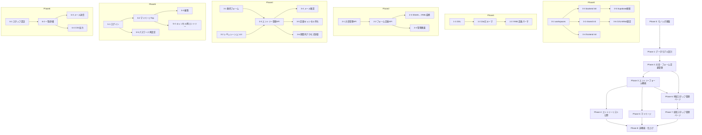

# 地域クイズ最強位・新人王共通エントリーフォーム 実装タスクリスト

## Overview

`requirements.md` の要件を、`CLAUDE.md` に定義された技術構成(Bun workspaces + Hono/Cloudflare Workers + SvelteKit + Supabase)に基づいて実装するためのタスクリストです。現時点(2026-08-23)ではコードは未着手のため、Phase 0 でモノレポの土台を作るところから始めます。

データモデルの設計方針(このタスクリスト全体で前提とする内容):

- **地域(region)** の下に **大会(tournament)** があり、大会は「地域 × 大会種別(最強位 / 新人王)」の組で一意に決まる。
- **参加者アカウント(participant)** は「メールアドレス + パスワード」で識別され、1つの地域にひもづく(地域をまたいだ参加ができないため)。同じ地域内であれば、同じ participant が複数の大会(最強位・新人王)に entry を持てる。
- **エントリー(entry)** は participant × tournament の組ごとに1件。ステータスは `pending_verification`(メール確認待ち) → `confirmed`(確定) / `waitlisted`(キャンセル待ち) → `cancelled`(キャンセル済み)と遷移する。
- **フォーム項目定義** は tournament ごとに YAML で定義し、DB(`form_field_defs` テーブル)に展開して保存する。フロントエンドはこの定義を読んでフォームを動的生成する。
- **レギュレーション** は tournament ごとに複数定義でき、条件によっては「優先エントリー期間」を持つ。優先期間中は、対象レギュレーションを満たす参加者のみがエントリーできる。
- メール送信サービス・パスワードハッシュ方式は Cloudflare Workers(Node.js 実行環境ではない)で動く必要があるため、Web Crypto ベースの実装 / Workers 対応のメール API を選定する。具体的なメール送信サービスの選定は Task 0-6 で決定する前提とする(暫定で Resend を想定)。
- 参加者・スタッフのログインセッションは **JWT**(`hono/jwt` で署名・検証)で管理する。発行した JWT を httpOnly Cookie に格納して送受信し、DB 上にセッションレコードは持たない(Task 5-1, Task 6-1)。

### フェーズ・タスクの概要一覧

* Phase 0: モノレポ基盤構築
  * Task 0-1: Bun workspaces のルート構成
  * Task 0-2: `packages/shared` の初期構成
  * Task 0-3: `apps/backend` の Hono + Cloudflare Workers 初期構成
  * Task 0-4: `apps/frontend` の SvelteKit 初期構成
  * Task 0-5: Supabase プロジェクト接続とマイグレーション基盤
  * Task 0-6: Lint / Format / CI とメール送信サービスの選定
* Phase 1: データモデル設計
  * Task 1-1: Supabase スキーマ定義(DDL マイグレーション)
  * Task 1-2: `packages/shared` の Zod スキーマ定義
  * Task 1-3: フォーム項目定義 YAML のスキーマとパーサ
* Phase 2: 大会・フォーム定義管理(統括スタッフ)
  * Task 2-1: 大会(tournament)管理 API
  * Task 2-2: フォーム定義・レギュレーション登録 API
  * Task 2-3: Google スプレッドシート → YAML 変換ツール
  * Task 2-4: 大会作成・フォーム定義管理画面
* Phase 3: エントリーフォーム機能(参加者向け)
  * Task 3-1: フォーム動的レンダリング
  * Task 3-2: レギュレーション確認 UI と優先期間ロジック
  * Task 3-3: エントリー登録 API
  * Task 3-4: メールアドレス確認フロー
  * Task 3-5: 定員管理とキャンセル待ちロジック
  * Task 3-6: エントリー期間外アクセス制御
* Phase 4: エントリーリスト公開機能
  * Task 4-1: 公開エントリーリスト API
  * Task 4-2: 公開エントリーリストページ
* Phase 5: 参加者向けマイページ
  * Task 5-1: 参加者ログイン API とセッション管理
  * Task 5-2: マイページ トップ(複数大会のエントリー状況)
  * Task 5-3: エントリー内容編集
  * Task 5-4: エントリーキャンセルと再エントリー
  * Task 5-5: パスワード再設定機能
* Phase 6: 地域スタッフ向け管理ページ
  * Task 6-1: スタッフ認証・権限管理
  * Task 6-2: エントリー状況一覧・詳細確認
  * Task 6-3: 参加者へのメール送信機能
  * Task 6-4: CSV 出力機能
* Phase 7: 統括スタッフ向け管理ページ
  * Task 7-1: 全地域横断ダッシュボード
* Phase 8: 非機能・仕上げ
  * Task 8-1: E2E テスト整備
  * Task 8-2: デプロイパイプライン整備

## Dependency graph



## Phase 0: モノレポ基盤構築

### Task 0-1: Bun workspaces のルート構成

#### 実装・更新内容

* リポジトリ直下に `apps/backend`, `apps/frontend`, `packages/shared` のディレクトリを作成する。
* ルート `package.json` に `workspaces` を定義し、共通スクリプト(`dev`, `build`, `typecheck`, `test`, `lint`)を各ワークスペースに委譲する形で用意する。
* ルート `tsconfig.base.json` を作成し、各ワークスペースの `tsconfig.json` から `extends` する。

#### コードスニペット

`package.json`

```json
{
  "name": "regional-quiz-entry-form",
  "private": true,
  "workspaces": ["apps/*", "packages/*"],
  "scripts": {
    "dev:backend": "bun --filter ./apps/backend dev",
    "dev:frontend": "bun --filter ./apps/frontend dev",
    "typecheck": "bun --filter '*' typecheck",
    "test": "bun --filter '*' test",
    "lint": "bun --filter '*' lint"
  }
}
```

`tsconfig.base.json`

```json
{
  "compilerOptions": {
    "strict": true,
    "target": "ES2022",
    "module": "ESNext",
    "moduleResolution": "Bundler",
    "skipLibCheck": true,
    "esModuleInterop": true
  }
}
```

#### テスト

* 手動確認のみ(ワークスペース構成の疎通確認)
  * `bun install` がエラーなく完了すること
  * `bun --filter '*' typecheck` が(中身が空でも)実行できること

#### 依存タスク

* なし(最初のタスク)

### Task 0-2: `packages/shared` の初期構成

#### 実装・更新内容

* `packages/shared/package.json`、`tsconfig.json` を作成し、`zod` と `yaml`(YAML パース用)を依存に追加する。
* `packages/shared/src/index.ts` をエントリポイントとして用意し、以降のタスクでスキーマを追加していく器を作る。

#### コードスニペット

`packages/shared/package.json`

```json
{
  "name": "@regional-quiz/shared",
  "version": "0.0.0",
  "type": "module",
  "main": "src/index.ts",
  "dependencies": {
    "zod": "^3.23.0",
    "yaml": "^2.5.0"
  }
}
```

`packages/shared/src/index.ts`

```typescript
export * from './schemas/region';
export * from './schemas/tournament';
export * from './schemas/regulation';
export * from './schemas/form-definition';
export * from './schemas/entry';
export * from './schemas/participant';
export * from './schemas/staff';
export * from './schemas/auth';
```

#### テスト

* `apps/backend` / `apps/frontend` の双方から `@regional-quiz/shared` を workspace 依存として import できることを型チェックで確認する(Phase 1 実施後に本格テスト)

#### 依存タスク

* Task 0-1

### Task 0-3: `apps/backend` の Hono + Cloudflare Workers 初期構成

#### 実装・更新内容

* `apps/backend` に Hono アプリの雛形を作成し、`wrangler.toml` で Cloudflare Workers 向けの設定(bindings は Phase 1 以降で追加)を用意する。
* `Bindings` / `Variables` の型を1箇所にまとめ、`Hono<Env>()` で生成する。
* ルートをチェーンして `AppType` をエクスポートする形を、空のヘルスチェックルートで先に確立しておく(以降のタスクで `routes/*` をチェーンに足していく)。

#### コードスニペット

`apps/backend/src/types/env.ts`

```typescript
export interface Bindings {
  SUPABASE_URL: string;
  SUPABASE_SERVICE_ROLE_KEY: string;
  MAIL_API_KEY: string;
  SESSION_SECRET: string;
}

export interface Variables {
  requestId: string;
}

export interface Env {
  Bindings: Bindings;
  Variables: Variables;
}
```

`apps/backend/src/index.ts`

```typescript
import { Hono } from 'hono';
import type { Env } from './types/env';

const app = new Hono<Env>();

const routes = app.get('/healthz', (c) => c.json({ ok: true }));
// 以降のタスクで .route('/tournaments', tournamentsRoute) のようにチェーンしていく

export type AppType = typeof routes;
export default app;
```

`apps/backend/wrangler.toml`

```toml
name = "regional-quiz-backend"
main = "src/index.ts"
compatibility_date = "2026-08-01"

[vars]
# 非機密の設定値のみここに記載し、機密情報は `wrangler secret put` で登録する
```

#### テスト

* In `apps/backend/src/index.test.ts`
  * `GET /healthz returns ok`
    * `app.request('/healthz')` を呼び、ステータス 200 と `{ ok: true }` を assert する

#### 依存タスク

* Task 0-1

### Task 0-4: `apps/frontend` の SvelteKit 初期構成

#### 実装・更新内容

* `apps/frontend` に SvelteKit(Svelte 5)プロジェクトを作成し、`adapter-cloudflare` を設定する。
* `hc<AppType>()` を使った型安全 API クライアントの初期化コードを `src/lib/api.ts` に用意する(バックエンドの `AppType` を `@regional-quiz/backend` のような形で参照できるよう、`apps/backend` の型のみを参照する `exports` 設定を行う)。

#### コードスニペット

`apps/frontend/src/lib/api.ts`

```typescript
import { hc } from 'hono/client';
import type { AppType } from '../../../backend/src/index';

export function createApiClient(fetchImpl: typeof fetch = fetch) {
  return hc<AppType>('/api', { fetch: fetchImpl });
}
```

`apps/frontend/svelte.config.js`

```javascript
import adapter from '@sveltejs/adapter-cloudflare';

export default {
  kit: {
    adapter: adapter(),
  },
};
```

#### テスト

* 手動確認: `bun --filter ./apps/frontend dev` でトップページが表示できること
* 型チェック: `createApiClient().healthz.$get` のような呼び出しが型補完される(`AppType` が空でも解決できる)ことを確認

#### 依存タスク

* Task 0-1, Task 0-3(`AppType` の型を参照するため)

### Task 0-5: Supabase プロジェクト接続とマイグレーション基盤

#### 実装・更新内容

* Supabase プロジェクトを作成し、`apps/backend` から `@supabase/supabase-js` 経由で接続できるようにする(Cloudflare Workers は Node.js ランタイムではないため、`fetch` ベースで動く `@supabase/supabase-js` を採用する)。
* マイグレーション管理には Supabase CLI(`supabase/migrations/*.sql`)を使い、`bun run db:migrate` 相当のスクリプトを用意する。
* `apps/backend/src/lib/db.ts` に Supabase クライアントのファクトリを実装する。

#### コードスニペット

`apps/backend/src/lib/db.ts`

```typescript
import { createClient } from '@supabase/supabase-js';
import type { Bindings } from '../types/env';

export function createDbClient(env: Bindings) {
  return createClient(env.SUPABASE_URL, env.SUPABASE_SERVICE_ROLE_KEY, {
    auth: { persistSession: false },
  });
}
```

`package.json`(ルート、追記)

```json
{
  "scripts": {
    "db:migrate": "supabase db push",
    "db:new": "supabase migration new"
  }
}
```

#### テスト

* 手動確認: ローカル Supabase(`supabase start`)に対して `db:migrate` が空のマイグレーションで成功すること
* In `apps/backend/src/lib/db.test.ts`
  * `createDbClient returns a client`
    * ダミーの env を渡してエラーなくインスタンスが生成されることを assert する

#### 依存タスク

* Task 0-3

### Task 0-6: Lint / Format / CI とメール送信サービスの選定

#### 実装・更新内容

* `gts`(Google TypeScript Style Guide 準拠の ESLint + Prettier + tsc 設定)を導入する。
* GitHub Actions で `typecheck` / `lint` / `test` を実行する CI を用意する。
* メール送信サービスを決定する(暫定: Resend。Cloudflare Workers から HTTP API で呼べること、送信元ドメイン認証ができることを条件に選定する)。決定した内容を `apps/backend/src/lib/mailer.ts` のインターフェースとして固定し、以降のタスク(3-4, 5-5, 6-3)はこのインターフェースにのみ依存する。

#### コードスニペット

`apps/backend/src/lib/mailer.ts`

```typescript
export interface SendMailInput {
  to: string;
  subject: string;
  html: string;
}

export interface MailSender {
  send(input: SendMailInput): Promise<void>;
}

export class ResendMailSender implements MailSender {
  constructor(private readonly apiKey: string) {}

  async send(input: SendMailInput): Promise<void> {
    const res = await fetch('https://api.resend.com/emails', {
      method: 'POST',
      headers: {
        Authorization: `Bearer ${this.apiKey}`,
        'Content-Type': 'application/json',
      },
      body: JSON.stringify({ from: 'entry@regionalquiz.example', ...input }),
    });
    if (!res.ok) {
      throw new Error(`Failed to send mail: ${res.status}`);
    }
  }
}
```

`.github/workflows/ci.yml`

```yaml
name: ci
on: [push, pull_request]
jobs:
  check:
    runs-on: ubuntu-latest
    steps:
      - uses: actions/checkout@v4
      - uses: oven-sh/setup-bun@v2
      - run: bun install
      - run: bun run typecheck
      - run: bun run lint
      - run: bun run test
```

#### テスト

* CI 上で `typecheck` / `lint` / `test` が空プロジェクトに対して green になることを確認する
* In `apps/backend/src/lib/mailer.test.ts`
  * `ResendMailSender.send throws on non-ok response`
    * `fetch` をモックして 4xx を返させ、エラーが投げられることを assert する

#### 依存タスク

* Task 0-2, Task 0-3

## Phase 1: データモデル設計

### Task 1-1: Supabase スキーマ定義(DDL マイグレーション)

#### 実装・更新内容

* 以下のテーブルをマイグレーションとして定義する。
  * `regions`: 地域マスタ
  * `tournaments`: 大会(地域 × 種別)。エントリー期間、定員、ステータスを持つ
  * `regulations`: 大会ごとのレギュレーション条件。優先期間(`priority_starts_at` / `priority_ends_at`)を持てる
  * `form_field_defs`: 大会ごとの追加フォーム項目定義(YAML から展開)
  * `participants`: 参加者アカウント(email 一意、地域にひもづく)
  * `entries`: participant × tournament のエントリー本体
  * `email_verification_tokens`: エントリー確認メール用トークン
  * `password_reset_tokens`: パスワード再設定用トークン(使い捨て)
  * `staff_accounts`: 地域スタッフ / 統括スタッフのアカウント

#### コードスニペット

`supabase/migrations/0001_init.sql`

```sql
create type tournament_type as enum ('saikyoi', 'shinjinou');
create type entry_status as enum ('pending_verification', 'confirmed', 'waitlisted', 'cancelled');
create type staff_role as enum ('regional', 'general');

create table regions (
  id uuid primary key default gen_random_uuid(),
  slug text unique not null,
  name text not null
);

create table tournaments (
  id uuid primary key default gen_random_uuid(),
  region_id uuid not null references regions (id),
  type tournament_type not null,
  name text not null,
  capacity integer,
  entry_opens_at timestamptz not null,
  entry_closes_at timestamptz not null,
  created_at timestamptz not null default now(),
  unique (region_id, type)
);

create table regulations (
  id uuid primary key default gen_random_uuid(),
  tournament_id uuid not null references tournaments (id),
  label text not null,
  priority_starts_at timestamptz,
  priority_ends_at timestamptz,
  display_order integer not null default 0
);

create table form_field_defs (
  id uuid primary key default gen_random_uuid(),
  tournament_id uuid not null references tournaments (id),
  field_key text not null,
  label text not null,
  field_type text not null check (field_type in ('checkbox', 'radio', 'textarea')),
  required boolean not null default false,
  options jsonb,
  display_order integer not null default 0,
  unique (tournament_id, field_key)
);

create table participants (
  id uuid primary key default gen_random_uuid(),
  region_id uuid not null references regions (id),
  email text not null unique,
  password_hash text not null,
  created_at timestamptz not null default now()
);

create table entries (
  id uuid primary key default gen_random_uuid(),
  participant_id uuid not null references participants (id),
  tournament_id uuid not null references tournaments (id),
  name text not null,
  furigana text not null,
  display_name text not null,
  regulation_id uuid not null references regulations (id),
  free_text text,
  custom_field_values jsonb not null default '{}',
  status entry_status not null default 'pending_verification',
  waitlist_position integer,
  email_verified_at timestamptz,
  cancelled_at timestamptz,
  created_at timestamptz not null default now(),
  updated_at timestamptz not null default now(),
  unique (participant_id, tournament_id)
);

create table email_verification_tokens (
  id uuid primary key default gen_random_uuid(),
  entry_id uuid not null references entries (id),
  token text not null unique,
  expires_at timestamptz not null,
  used_at timestamptz
);

create table password_reset_tokens (
  id uuid primary key default gen_random_uuid(),
  participant_id uuid not null references participants (id),
  token text not null unique,
  expires_at timestamptz not null,
  used_at timestamptz
);

create table staff_accounts (
  id uuid primary key default gen_random_uuid(),
  email text not null unique,
  password_hash text not null,
  role staff_role not null,
  region_id uuid references regions (id),
  tournament_type tournament_type,
  created_at timestamptz not null default now()
);
```

#### テスト

* 手動確認: `supabase db push` がエラーなく適用できること
* In `apps/backend/src/lib/db-schema.test.ts`(ローカル Supabase を使った統合テスト)
  * `entries table enforces unique participant/tournament pair`
    * 同じ participant_id + tournament_id で 2 回 insert し、2 回目が一意制約違反になることを assert する

#### 依存タスク

* Task 0-5

### Task 1-2: `packages/shared` の Zod スキーマ定義

#### 実装・更新内容

* Task 1-1 のテーブル構造に対応する Zod スキーマを `packages/shared/src/schemas/*` に定義する。
* リクエスト用スキーマ(例: `EntryInputSchema`)とレスポンス/DB 表現用の型(例: `Entry`)を分けて定義し、パスワード確認欄など「DB には保存しないが入力時には必要なフィールド」を明確にする。

#### コードスニペット

`packages/shared/src/schemas/entry.ts`

```typescript
import { z } from 'zod';

export const EntryInputSchema = z
  .object({
    name: z.string().min(1),
    furigana: z.string().min(1),
    displayName: z.string().min(1),
    email: z.string().email(),
    password: z.string().min(8),
    passwordConfirm: z.string().min(8),
    regulationId: z.string().uuid(),
    freeText: z.string().optional(),
    customFieldValues: z.record(z.string(), z.union([z.string(), z.array(z.string())])),
  })
  .refine((data) => data.password === data.passwordConfirm, {
    path: ['passwordConfirm'],
    message: 'パスワードが一致しません',
  });
export type EntryInput = z.infer<typeof EntryInputSchema>;

export const EntryStatusSchema = z.enum([
  'pending_verification',
  'confirmed',
  'waitlisted',
  'cancelled',
]);
export type EntryStatus = z.infer<typeof EntryStatusSchema>;

export const EntrySchema = z.object({
  id: z.string().uuid(),
  tournamentId: z.string().uuid(),
  name: z.string(),
  furigana: z.string(),
  displayName: z.string(),
  regulationId: z.string().uuid(),
  freeText: z.string().nullable(),
  customFieldValues: z.record(z.string(), z.unknown()),
  status: EntryStatusSchema,
  waitlistPosition: z.number().int().nullable(),
});
export type Entry = z.infer<typeof EntrySchema>;
```

`packages/shared/src/schemas/tournament.ts`

```typescript
import { z } from 'zod';

export const TournamentTypeSchema = z.enum(['saikyoi', 'shinjinou']);
export type TournamentType = z.infer<typeof TournamentTypeSchema>;

export const TournamentSchema = z.object({
  id: z.string().uuid(),
  regionId: z.string().uuid(),
  type: TournamentTypeSchema,
  name: z.string(),
  capacity: z.number().int().positive().nullable(),
  entryOpensAt: z.string().datetime(),
  entryClosesAt: z.string().datetime(),
});
export type Tournament = z.infer<typeof TournamentSchema>;
```

#### テスト

* In `packages/shared/src/schemas/entry.test.ts`
  * `EntryInputSchema rejects mismatched password confirmation`
    * `password` と `passwordConfirm` を違う値にして parse し、`passwordConfirm` パスにエラーが出ることを assert する
  * `EntryInputSchema accepts a valid payload`
    * 正常系データで `success: true` になることを assert する

#### 依存タスク

* Task 0-2, Task 1-1

### Task 1-3: フォーム項目定義 YAML のスキーマとパーサ

#### 実装・更新内容

* 地域ごとの追加フォーム項目を記述する YAML のスキーマを Zod で定義し(`FormDefinitionYamlSchema`)、パース関数 `parseFormDefinitionYaml` を `packages/shared` に実装する。
* パース結果を Task 1-1 の `form_field_defs` テーブルの行群に変換するユーティリティも用意する。

#### コードスニペット

`packages/shared/src/schemas/form-definition.ts`

```typescript
import { z } from 'zod';
import { parse as parseYaml } from 'yaml';

export const FormFieldTypeSchema = z.enum(['checkbox', 'radio', 'textarea']);

export const FormFieldDefYamlSchema = z.object({
  key: z.string().regex(/^[a-z][a-z0-9_]*$/),
  label: z.string(),
  type: FormFieldTypeSchema,
  required: z.boolean().default(false),
  options: z.array(z.string()).optional(),
});

export const FormDefinitionYamlSchema = z.object({
  tournamentSlug: z.string(),
  fields: z.array(FormFieldDefYamlSchema),
});
export type FormDefinitionYaml = z.infer<typeof FormDefinitionYamlSchema>;

export function parseFormDefinitionYaml(yamlText: string): FormDefinitionYaml {
  return FormDefinitionYamlSchema.parse(parseYaml(yamlText));
}
```

#### テスト

* In `packages/shared/src/schemas/form-definition.test.ts`
  * `parseFormDefinitionYaml parses a valid document`
    * checkbox/radio/textarea を1つずつ含む YAML 文字列を渡し、`fields.length === 3` を assert する
  * `parseFormDefinitionYaml rejects an invalid field key`
    * `key` に大文字を含む YAML を渡し、`ZodError` が投げられることを assert する

#### 依存タスク

* Task 1-2

## Phase 2: 大会・フォーム定義管理(統括スタッフ)

### Task 2-1: 大会(tournament)管理 API

#### 実装・更新内容

* `apps/backend/src/routes/tournaments.ts` に、統括スタッフのみが呼べる大会の作成・更新・一覧取得 API を実装する。
* すべてのボディを `zValidator` + `packages/shared` のスキーマで検証する。
* `apps/backend/src/index.ts` のルートチェーンに `.route('/tournaments', tournamentsRoute)` を追加する。

#### コードスニペット

`apps/backend/src/routes/tournaments.ts`

```typescript
import { Hono } from 'hono';
import { zValidator } from '@hono/zod-validator';
import { TournamentSchema } from '@regional-quiz/shared';
import type { Env } from '../types/env';
import { requireGeneralStaff } from '../middleware/staff-auth';
import { createDbClient } from '../lib/db';

const CreateTournamentSchema = TournamentSchema.omit({ id: true });

export const tournamentsRoute = new Hono<Env>()
  .use('*', requireGeneralStaff())
  .get('/', async (c) => {
    const db = createDbClient(c.env);
    const { data, error } = await db.from('tournaments').select('*');
    if (error) return c.json({ error: error.message }, 500);
    return c.json(data);
  })
  .post('/', zValidator('json', CreateTournamentSchema), async (c) => {
    const db = createDbClient(c.env);
    const { data, error } = await db
      .from('tournaments')
      .insert(c.req.valid('json'))
      .select()
      .single();
    if (error) return c.json({ error: error.message }, 400);
    return c.json(data, 201);
  });
```

#### テスト

* In `apps/backend/src/routes/tournaments.test.ts`
  * `POST /tournaments creates a tournament for general staff`
    * 統括スタッフの認証コンテキストを付けてリクエストし、201 と作成された大会を assert する
  * `POST /tournaments rejects regional staff`
    * 地域スタッフのコンテキストでリクエストし、403 を assert する
  * `POST /tournaments rejects invalid body`
    * `entryOpensAt` を欠いたボディでリクエストし、400 を assert する

#### 依存タスク

* Task 1-2, Task 6-1(スタッフ認証ミドルウェア。並行実装可、認証部分はスタブでも可)

### Task 2-2: フォーム定義・レギュレーション登録 API

#### 実装・更新内容

* 大会に紐づくフォーム定義(YAML アップロード)とレギュレーションを登録・更新する API を実装する。
* YAML アップロード時は Task 1-3 の `parseFormDefinitionYaml` を通し、`form_field_defs` テーブルへ差分反映(既存の `field_key` は update、新規は insert、YAML に無いものは削除)する。

#### コードスニペット

`apps/backend/src/routes/form-definitions.ts`

```typescript
import { Hono } from 'hono';
import { zValidator } from '@hono/zod-validator';
import { z } from 'zod';
import { parseFormDefinitionYaml } from '@regional-quiz/shared';
import type { Env } from '../types/env';
import { requireGeneralStaff } from '../middleware/staff-auth';
import { syncFormFieldDefs } from '../lib/form-definitions';

const UploadYamlSchema = z.object({ yaml: z.string() });

export const formDefinitionsRoute = new Hono<Env>()
  .use('*', requireGeneralStaff())
  .put('/:tournamentId', zValidator('json', UploadYamlSchema), async (c) => {
    const parsed = parseFormDefinitionYaml(c.req.valid('json').yaml);
    await syncFormFieldDefs(c.env, c.req.param('tournamentId'), parsed.fields);
    return c.json({ ok: true });
  });
```

`apps/backend/src/lib/form-definitions.ts`

```typescript
import type { FormFieldDefYaml } from '@regional-quiz/shared';
import type { Bindings } from '../types/env';
import { createDbClient } from './db';

export async function syncFormFieldDefs(
  env: Bindings,
  tournamentId: string,
  fields: FormFieldDefYaml[],
): Promise<void> {
  const db = createDbClient(env);
  const rows = fields.map((field, index) => ({
    tournament_id: tournamentId,
    field_key: field.key,
    label: field.label,
    field_type: field.type,
    required: field.required,
    options: field.options ?? null,
    display_order: index,
  }));
  await db.from('form_field_defs').delete().eq('tournament_id', tournamentId);
  if (rows.length > 0) {
    await db.from('form_field_defs').insert(rows);
  }
}
```

#### テスト

* In `apps/backend/src/lib/form-definitions.test.ts`
  * `syncFormFieldDefs replaces existing fields`
    * 既存 2 件・新規 YAML 1 件で呼び出し、最終的にテーブルに 1 件だけ残ることを assert する(ローカル Supabase 統合テスト)

#### 依存タスク

* Task 1-3, Task 2-1

### Task 2-3: Google スプレッドシート → YAML 変換ツール

#### 実装・更新内容

* 地域スタッフが記入した Google スプレッドシートの内容を、統括スタッフが URL 指定で取り込み、Task 1-3 の YAML 形式に変換するツールを実装する。
* Google Sheets API(サービスアカウント認証)でシート内容を取得し、決め打ちの列フォーマット(`key`, `label`, `type`, `required`, `options`)からフィールド定義配列に変換する。
* 変換結果はプレビュー用に返すのみとし、実際の保存は Task 2-2 の API を呼び出す形にする(変換と保存を分離)。

#### コードスニペット

`apps/backend/src/lib/sheet-to-form-definition.ts`

```typescript
import { stringify as stringifyYaml } from 'yaml';
import { FormFieldDefYamlSchema } from '@regional-quiz/shared';

interface SheetRow {
  key: string;
  label: string;
  type: string;
  required: string;
  options: string;
}

export async function fetchSheetRows(
  spreadsheetId: string,
  apiKey: string,
): Promise<SheetRow[]> {
  const url = `https://sheets.googleapis.com/v4/spreadsheets/${spreadsheetId}/values/A2:E?key=${apiKey}`;
  const res = await fetch(url);
  if (!res.ok) throw new Error(`Failed to fetch sheet: ${res.status}`);
  const { values } = (await res.json()) as { values: string[][] };
  return values.map(([key, label, type, required, options]) => ({
    key,
    label,
    type,
    required,
    options,
  }));
}

export function sheetRowsToYaml(tournamentSlug: string, rows: SheetRow[]): string {
  const fields = rows.map((row) =>
    FormFieldDefYamlSchema.parse({
      key: row.key,
      label: row.label,
      type: row.type,
      required: row.required === 'TRUE',
      options: row.options ? row.options.split(',').map((s) => s.trim()) : undefined,
    }),
  );
  return stringifyYaml({ tournamentSlug, fields });
}
```

`apps/backend/src/routes/sheet-import.ts`

```typescript
import { Hono } from 'hono';
import { zValidator } from '@hono/zod-validator';
import { z } from 'zod';
import type { Env } from '../types/env';
import { requireGeneralStaff } from '../middleware/staff-auth';
import { fetchSheetRows, sheetRowsToYaml } from '../lib/sheet-to-form-definition';

const ImportSchema = z.object({ spreadsheetId: z.string(), tournamentSlug: z.string() });

export const sheetImportRoute = new Hono<Env>()
  .use('*', requireGeneralStaff())
  .post('/preview', zValidator('json', ImportSchema), async (c) => {
    const { spreadsheetId, tournamentSlug } = c.req.valid('json');
    const rows = await fetchSheetRows(spreadsheetId, c.env.MAIL_API_KEY);
    return c.json({ yaml: sheetRowsToYaml(tournamentSlug, rows) });
  });
```

#### テスト

* In `apps/backend/src/lib/sheet-to-form-definition.test.ts`
  * `sheetRowsToYaml converts rows into valid yaml`
    * checkbox 用 row(options カンマ区切り)を渡し、`parseFormDefinitionYaml`(Task 1-3)にかけて往復できることを assert する
  * `sheetRowsToYaml throws on invalid field key`
    * 不正な `key` の row を渡し、`ZodError` が投げられることを assert する

#### 依存タスク

* Task 1-3, Task 2-2

### Task 2-4: 大会作成・フォーム定義管理画面

#### 実装・更新内容

* 統括スタッフ向けに、大会の作成・編集フォームと、スプレッドシート URL 入力 → YAML プレビュー → 保存の一連の UI を `apps/frontend/src/routes/admin/tournaments/` に実装する。
* Task 0-4 の `createApiClient()` を使い、Task 2-1〜2-3 の API を呼び出す。

#### コードスニペット

`apps/frontend/src/routes/admin/tournaments/new/+page.svelte`

```svelte
<script lang="ts">
  import { createApiClient } from '$lib/api';

  let spreadsheetId = $state('');
  let tournamentSlug = $state('');
  let previewYaml = $state<string | null>(null);

  const api = createApiClient();

  async function handlePreview() {
    const res = await api['sheet-import'].preview.$post({
      json: { spreadsheetId, tournamentSlug },
    });
    const body = await res.json();
    previewYaml = body.yaml;
  }
</script>

<form onsubmit={(e) => { e.preventDefault(); handlePreview(); }}>
  <input bind:value={tournamentSlug} placeholder="大会スラッグ" />
  <input bind:value={spreadsheetId} placeholder="スプレッドシートID" />
  <button type="submit">YAMLプレビュー</button>
</form>

{#if previewYaml}
  <pre>{previewYaml}</pre>
{/if}
```

#### テスト

* Component test(`@testing-library/svelte`): `admin/tournaments/new` で入力 → プレビューボタン押下 → `api['sheet-import'].preview.$post` が呼ばれることを mock で assert する
* 手動確認: dev サーバーでスプレッドシート取り込み〜YAML プレビュー〜保存までの一連のフローを確認する

#### 依存タスク

* Task 0-4, Task 2-1, Task 2-2, Task 2-3

## Phase 3: エントリーフォーム機能(参加者向け)

### Task 3-1: フォーム動的レンダリング

#### 実装・更新内容

* 大会の `form_field_defs`(checkbox/radio/textarea)を取得し、共通コンポーネントで動的にフォームを描画する仕組みを実装する。
* `apps/frontend/src/lib/components/DynamicFormField.svelte` を用意し、`type` によって描画を切り替える。

#### コードスニペット

`apps/frontend/src/lib/components/DynamicFormField.svelte`

```svelte
<script lang="ts">
  import type { FormFieldDefYaml } from '@regional-quiz/shared';

  interface Props {
    field: FormFieldDefYaml;
    value: string | string[];
    onChange: (value: string | string[]) => void;
  }

  let { field, value, onChange }: Props = $props();
</script>

{#if field.type === 'textarea'}
  <textarea required={field.required} value={value as string}
    oninput={(e) => onChange((e.target as HTMLTextAreaElement).value)}></textarea>
{:else if field.type === 'radio'}
  {#each field.options ?? [] as option (option)}
    <label>
      <input type="radio" name={field.key} value={option}
        checked={value === option}
        onchange={() => onChange(option)} />
      {option}
    </label>
  {/each}
{:else if field.type === 'checkbox'}
  {#each field.options ?? [] as option (option)}
    <label>
      <input type="checkbox" value={option}
        checked={(value as string[]).includes(option)}
        onchange={(e) => {
          const checked = (e.target as HTMLInputElement).checked;
          const current = value as string[];
          onChange(checked ? [...current, option] : current.filter((v) => v !== option));
        }} />
      {option}
    </label>
  {/each}
{/if}
```

#### テスト

* Component test: `radio` フィールドで選択肢クリック時に `onChange` が選択値で呼ばれることを assert する
* Component test: `checkbox` フィールドで複数選択・解除時に配列が正しく更新されることを assert する

#### 依存タスク

* Task 1-3, Task 0-4

### Task 3-2: レギュレーション確認 UI と優先期間ロジック

#### 実装・更新内容

* 大会に紐づくレギュレーション一覧を表示し、参加者が満たすものを1つ以上選択(チェック)させる UI を実装する。
* 「現在時刻が優先期間内であれば、優先期間の設定されたレギュレーションのいずれかを選ばないとエントリーできない」判定ロジックを `packages/shared` に共通関数として実装し、フロント(エントリー不可の表示)とバックエンド(Task 3-3 のバリデーション)の両方から使う。

#### コードスニペット

`packages/shared/src/logic/regulation-eligibility.ts`

```typescript
export interface RegulationWindow {
  id: string;
  priorityStartsAt: string | null;
  priorityEndsAt: string | null;
}

export function isRegulationSelectionAllowed(
  regulations: RegulationWindow[],
  selectedRegulationId: string,
  now: Date,
): boolean {
  const activePriorityIds = regulations
    .filter((r) => r.priorityStartsAt && r.priorityEndsAt)
    .filter((r) => now >= new Date(r.priorityStartsAt!) && now <= new Date(r.priorityEndsAt!))
    .map((r) => r.id);

  if (activePriorityIds.length === 0) return true;
  return activePriorityIds.includes(selectedRegulationId);
}
```

#### テスト

* In `packages/shared/src/logic/regulation-eligibility.test.ts`
  * `allows any regulation when no priority window is active`
    * 優先期間を持たないレギュレーションのみで呼び出し、`true` を assert する
  * `restricts to priority regulations during their window`
    * 優先期間中の時刻を渡し、優先対象外レギュレーションの選択で `false` を assert する
  * `opens up after the priority window ends`
    * 優先期間終了後の時刻を渡し、非優先レギュレーションの選択でも `true` を assert する

#### 依存タスク

* Task 1-2

### Task 3-3: エントリー登録 API

#### 実装・更新内容

* `POST /tournaments/:tournamentId/entries` を実装する。処理内容:
  1. エントリー期間内かチェック(Task 3-6 のロジックを利用)
  2. `EntryInputSchema` でバリデーション
  3. Task 3-2 の `isRegulationSelectionAllowed` でレギュレーション優先期間チェック
  4. participant を email で検索、無ければ作成(その際 region の一致もチェックし、別地域で既に登録済みなら拒否)
  5. パスワードを Web Crypto(PBKDF2)でハッシュ化
  6. `entries` を `pending_verification` で作成
  7. Task 3-4 のメール確認トークンを発行してメール送信

#### コードスニペット

`apps/backend/src/lib/password.ts`

```typescript
export async function hashPassword(password: string): Promise<string> {
  const salt = crypto.getRandomValues(new Uint8Array(16));
  const key = await crypto.subtle.importKey('raw', new TextEncoder().encode(password), 'PBKDF2', false, ['deriveBits']);
  const bits = await crypto.subtle.deriveBits(
    { name: 'PBKDF2', salt, iterations: 100_000, hash: 'SHA-256' },
    key,
    256,
  );
  return `${Buffer.from(salt).toString('hex')}:${Buffer.from(bits).toString('hex')}`;
}

export async function verifyPassword(password: string, stored: string): Promise<boolean> {
  const [saltHex, hashHex] = stored.split(':');
  const salt = Buffer.from(saltHex, 'hex');
  const key = await crypto.subtle.importKey('raw', new TextEncoder().encode(password), 'PBKDF2', false, ['deriveBits']);
  const bits = await crypto.subtle.deriveBits(
    { name: 'PBKDF2', salt, iterations: 100_000, hash: 'SHA-256' },
    key,
    256,
  );
  return Buffer.from(bits).toString('hex') === hashHex;
}
```

`apps/backend/src/routes/entries.ts`

```typescript
import { Hono } from 'hono';
import { zValidator } from '@hono/zod-validator';
import { EntryInputSchema } from '@regional-quiz/shared';
import type { Env } from '../types/env';
import { createEntry } from '../lib/entries';

export const entriesRoute = new Hono<Env>().post(
  '/:tournamentId/entries',
  zValidator('json', EntryInputSchema),
  async (c) => {
    const result = await createEntry(c.env, c.req.param('tournamentId'), c.req.valid('json'));
    if (!result.ok) return c.json({ error: result.error }, result.status);
    return c.json(result.entry, 201);
  },
);
```

`apps/backend/src/lib/entries.ts`

```typescript
import type { EntryInput } from '@regional-quiz/shared';
import type { Bindings } from '../types/env';
import { createDbClient } from './db';
import { hashPassword } from './password';
import { isRegulationSelectionAllowed } from '@regional-quiz/shared';
import { sendVerificationEmail } from './entry-verification';

type CreateEntryResult =
  | { ok: true; entry: { id: string } }
  | { ok: false; status: 400 | 403 | 409; error: string };

export async function createEntry(
  env: Bindings,
  tournamentId: string,
  input: EntryInput,
): Promise<CreateEntryResult> {
  const db = createDbClient(env);

  const { data: tournament } = await db
    .from('tournaments')
    .select('*, regulations(*)')
    .eq('id', tournamentId)
    .single();
  if (!tournament) return { ok: false, status: 400, error: 'invalid tournament' };

  const now = new Date();
  if (now < new Date(tournament.entry_opens_at) || now > new Date(tournament.entry_closes_at)) {
    return { ok: false, status: 403, error: 'entry period closed' };
  }
  if (!isRegulationSelectionAllowed(tournament.regulations, input.regulationId, now)) {
    return { ok: false, status: 403, error: 'regulation not eligible in priority window' };
  }

  const { data: existingParticipant } = await db
    .from('participants')
    .select('*')
    .eq('email', input.email)
    .maybeSingle();
  if (existingParticipant && existingParticipant.region_id !== tournament.region_id) {
    return { ok: false, status: 409, error: 'already registered in another region' };
  }

  const participantId =
    existingParticipant?.id ??
    (
      await db
        .from('participants')
        .insert({
          email: input.email,
          region_id: tournament.region_id,
          password_hash: await hashPassword(input.password),
        })
        .select('id')
        .single()
    ).data?.id;

  const { data: entry, error } = await db
    .from('entries')
    .insert({
      participant_id: participantId,
      tournament_id: tournamentId,
      name: input.name,
      furigana: input.furigana,
      display_name: input.displayName,
      regulation_id: input.regulationId,
      free_text: input.freeText,
      custom_field_values: input.customFieldValues,
      status: 'pending_verification',
    })
    .select('id')
    .single();
  if (error) return { ok: false, status: 409, error: error.message };

  await sendVerificationEmail(env, entry.id, input.email);
  return { ok: true, entry };
}
```

#### テスト

* In `apps/backend/src/lib/entries.test.ts`
  * `createEntry rejects entry outside the entry period`
    * `entry_closes_at` が過去の tournament で呼び出し、`status: 403` を assert する
  * `createEntry rejects a non-priority regulation during the priority window`
    * 優先期間中のレギュレーション設定で、対象外の `regulationId` を渡し `403` を assert する
  * `createEntry rejects an email already registered in a different region`
    * 別地域で登録済みの participant と同じ email で呼び出し `409` を assert する
  * `createEntry creates a pending_verification entry and sends a verification email`
    * 正常系で `entries` に1件作成され、`sendVerificationEmail` が呼ばれることを assert する(mock)

#### 依存タスク

* Task 1-2, Task 3-2, Task 3-4(メール送信は関数呼び出しのみ先に決めておき、並行実装可)

### Task 3-4: メールアドレス確認フロー

#### 実装・更新内容

* エントリー作成時に確認メールを送るユーティリティ `sendVerificationEmail` と、確認リンククリック時に `entries.status` を `confirmed`(または `waitlisted`、Task 3-5 参照)に更新する `GET /entries/verify` エンドポイントを実装する。
* トークンは `email_verification_tokens` に保存し、有効期限・使用済みチェックを行う。

#### コードスニペット

`apps/backend/src/lib/entry-verification.ts`

```typescript
import type { Bindings } from '../types/env';
import { createDbClient } from './db';
import { ResendMailSender } from './mailer';

export async function sendVerificationEmail(
  env: Bindings,
  entryId: string,
  email: string,
): Promise<void> {
  const db = createDbClient(env);
  const token = crypto.randomUUID();
  await db.from('email_verification_tokens').insert({
    entry_id: entryId,
    token,
    expires_at: new Date(Date.now() + 24 * 60 * 60 * 1000).toISOString(),
  });
  const mailer = new ResendMailSender(env.MAIL_API_KEY);
  await mailer.send({
    to: email,
    subject: 'エントリー確認メール',
    html: `<a href="https://entry.regionalquiz.example/verify?token=${token}">こちらをクリックしてエントリーを確定してください</a>`,
  });
}
```

`apps/backend/src/routes/entry-verification.ts`

```typescript
import { Hono } from 'hono';
import { zValidator } from '@hono/zod-validator';
import { z } from 'zod';
import type { Env } from '../types/env';
import { confirmEntryByToken } from '../lib/entry-confirmation';

export const entryVerificationRoute = new Hono<Env>().get(
  '/verify',
  zValidator('query', z.object({ token: z.string() })),
  async (c) => {
    const result = await confirmEntryByToken(c.env, c.req.valid('query').token);
    if (!result.ok) return c.json({ error: result.error }, 400);
    return c.json({ status: result.status });
  },
);
```

#### テスト

* In `apps/backend/src/lib/entry-confirmation.test.ts`
  * `confirmEntryByToken confirms a valid, unused token`
    * 有効なトークンで呼び出し、`entries.status` が `confirmed`(定員に空きがある場合)に更新されることを assert する
  * `confirmEntryByToken rejects an expired token`
    * `expires_at` が過去のトークンで呼び出し、エラーを assert する
  * `confirmEntryByToken rejects an already-used token`
    * `used_at` が設定済みのトークンで呼び出し、エラーを assert する

#### 依存タスク

* Task 0-6(メール送信サービス), Task 3-3, Task 3-5(定員判定と連動するため)

### Task 3-5: 定員管理とキャンセル待ちロジック

#### 実装・更新内容

* メール確認完了時、大会の `capacity` と現在の `confirmed` 件数を比較し、定員内なら `confirmed`、超過なら `waitlisted`(+ `waitlist_position` 採番)にする処理を `confirmEntryByToken` 内に実装する。
* エントリーキャンセル時(Task 5-4)、キャンセルされたのが `confirmed` なら、`waitlisted` の中で最も `waitlist_position` が小さいものを `confirmed` に繰り上げ、通知メールを送る処理 `promoteNextWaitlistedEntry` を実装する。

#### コードスニペット

`apps/backend/src/lib/entry-confirmation.ts`

```typescript
import type { Bindings } from '../types/env';
import { createDbClient } from './db';

type ConfirmResult =
  | { ok: true; status: 'confirmed' | 'waitlisted' }
  | { ok: false; error: string };

export async function confirmEntryByToken(env: Bindings, token: string): Promise<ConfirmResult> {
  const db = createDbClient(env);
  const { data: tokenRow } = await db
    .from('email_verification_tokens')
    .select('*, entries(*, tournaments(capacity))')
    .eq('token', token)
    .maybeSingle();

  if (!tokenRow || tokenRow.used_at || new Date(tokenRow.expires_at) < new Date()) {
    return { ok: false, error: 'invalid or expired token' };
  }

  const capacity = tokenRow.entries.tournaments.capacity;
  const { count: confirmedCount } = await db
    .from('entries')
    .select('id', { count: 'exact', head: true })
    .eq('tournament_id', tokenRow.entries.tournament_id)
    .eq('status', 'confirmed');

  const status = capacity && (confirmedCount ?? 0) >= capacity ? 'waitlisted' : 'confirmed';

  await db
    .from('entries')
    .update({
      status,
      email_verified_at: new Date().toISOString(),
      waitlist_position: status === 'waitlisted' ? (confirmedCount ?? 0) + 1 : null,
    })
    .eq('id', tokenRow.entry_id);

  await db.from('email_verification_tokens').update({ used_at: new Date().toISOString() }).eq('token', token);

  return { ok: true, status };
}
```

`apps/backend/src/lib/waitlist.ts`

```typescript
import type { Bindings } from '../types/env';
import { createDbClient } from './db';
import { ResendMailSender } from './mailer';

export async function promoteNextWaitlistedEntry(env: Bindings, tournamentId: string): Promise<void> {
  const db = createDbClient(env);
  const { data: next } = await db
    .from('entries')
    .select('*, participants(email)')
    .eq('tournament_id', tournamentId)
    .eq('status', 'waitlisted')
    .order('waitlist_position', { ascending: true })
    .limit(1)
    .maybeSingle();
  if (!next) return;

  await db.from('entries').update({ status: 'confirmed', waitlist_position: null }).eq('id', next.id);

  const mailer = new ResendMailSender(env.MAIL_API_KEY);
  await mailer.send({
    to: next.participants.email,
    subject: 'キャンセル待ちからの繰り上げについて',
    html: '<p>キャンセルが発生したため、あなたのエントリーが確定しました。</p>',
  });
}
```

#### テスト

* In `apps/backend/src/lib/entry-confirmation.test.ts`(追加ケース)
  * `confirmEntryByToken waitlists an entry when capacity is full`
    * capacity=1 で既に confirmed が1件ある状態で確認し、`status: 'waitlisted'` と `waitlist_position: 1` を assert する
* In `apps/backend/src/lib/waitlist.test.ts`
  * `promoteNextWaitlistedEntry promotes the entry with the smallest waitlist_position`
    * waitlist_position が 1, 2 の2件がある状態で呼び出し、position=1 の entry が `confirmed` になることを assert する
  * `promoteNextWaitlistedEntry does nothing when there is no waitlisted entry`
    * waitlist が空の状態で呼び出し、例外なく終了することを assert する

#### 依存タスク

* Task 3-4

### Task 3-6: エントリー期間外アクセス制御

#### 実装・更新内容

* エントリーフォームページ(`+page.server.ts`)で、大会の `entry_opens_at` / `entry_closes_at` と現在時刻を比較し、期間外であればスタッフ認証(セッション)がない限りアクセスを拒否(403 相当のページ表示)する `load` 関数を実装する。
* 判定ロジック自体は `packages/shared` に共通関数として置き、バックエンド(Task 3-3)・フロント両方から使う。

#### コードスニペット

`packages/shared/src/logic/entry-period.ts`

```typescript
export function isWithinEntryPeriod(
  opensAt: string,
  closesAt: string,
  now: Date = new Date(),
): boolean {
  return now >= new Date(opensAt) && now <= new Date(closesAt);
}
```

`apps/frontend/src/routes/[regionSlug]/[tournamentSlug]/entry/+page.server.ts`

```typescript
import { error } from '@sveltejs/kit';
import { isWithinEntryPeriod } from '@regional-quiz/shared';
import { createApiClient } from '$lib/api';
import type { PageServerLoad } from './$types';

export const load: PageServerLoad = async ({ params, fetch, locals }) => {
  const api = createApiClient(fetch);
  const res = await api.tournaments[':regionSlug'][':tournamentSlug'].$get({ param: params });
  if (!res.ok) throw error(404, 'tournament not found');
  const tournament = await res.json();

  if (!isWithinEntryPeriod(tournament.entryOpensAt, tournament.entryClosesAt) && !locals.staff) {
    throw error(403, 'エントリー期間外です');
  }

  return { tournament };
};
```

#### テスト

* In `packages/shared/src/logic/entry-period.test.ts`
  * `isWithinEntryPeriod returns true within the window`
  * `isWithinEntryPeriod returns false before opening / after closing`
* Component/route test: `locals.staff` が無い状態で期間外にアクセスすると 403 が throw されることを assert する。`locals.staff` がある場合はアクセスできることを assert する

#### 依存タスク

* Task 2-1, Task 6-1(スタッフセッションの `locals.staff` を提供)

## Phase 4: エントリーリスト公開機能

### Task 4-1: 公開エントリーリスト API

#### 実装・更新内容

* `GET /tournaments/:tournamentId/entry-list` を実装し、`confirmed` / `waitlisted` / `cancelled` のエントリーについて `displayName` とステータスのみを返す(個人情報である `name` / `furigana` / `email` / `freeText` 等は含めない)。
* `cancelled` は名前の代わりに「キャンセル」を返す(繰り上げは行わないため、順番はそのまま)。

#### コードスニペット

`apps/backend/src/routes/entry-list.ts`

```typescript
import { Hono } from 'hono';
import type { Env } from '../types/env';
import { createDbClient } from '../lib/db';

export const entryListRoute = new Hono<Env>().get('/:tournamentId/entry-list', async (c) => {
  const db = createDbClient(c.env);
  const { data } = await db
    .from('entries')
    .select('display_name, status, waitlist_position, created_at')
    .eq('tournament_id', c.req.param('tournamentId'))
    .in('status', ['confirmed', 'waitlisted', 'cancelled'])
    .order('created_at', { ascending: true });

  const list = (data ?? []).map((entry) => ({
    displayName: entry.status === 'cancelled' ? 'キャンセル' : entry.display_name,
    status: entry.status,
    waitlistPosition: entry.waitlist_position,
  }));
  return c.json(list);
});
```

#### テスト

* In `apps/backend/src/routes/entry-list.test.ts`
  * `GET entry-list omits personal fields`
    * レスポンス body に `email` / `name` / `furigana` キーが含まれないことを assert する
  * `GET entry-list masks cancelled entries as "キャンセル"`
    * `cancelled` の entry が `displayName: 'キャンセル'` で返ることを assert する

#### 依存タスク

* Task 1-1, Task 3-5

### Task 4-2: 公開エントリーリストページ

#### 実装・更新内容

* `apps/frontend/src/routes/[regionSlug]/[tournamentSlug]/list/+page.svelte` を実装し、Task 4-1 の API を `+page.server.ts` の `load` で取得して一覧表示する(認証不要・常時公開)。

#### コードスニペット

`apps/frontend/src/routes/[regionSlug]/[tournamentSlug]/list/+page.server.ts`

```typescript
import { createApiClient } from '$lib/api';
import type { PageServerLoad } from './$types';

export const load: PageServerLoad = async ({ params, fetch }) => {
  const api = createApiClient(fetch);
  const res = await api.tournaments[':tournamentId']['entry-list'].$get({
    param: { tournamentId: params.tournamentSlug },
  });
  return { entries: await res.json() };
};
```

`apps/frontend/src/routes/[regionSlug]/[tournamentSlug]/list/+page.svelte`

```svelte
<script lang="ts">
  import type { PageProps } from './$types';
  let { data }: PageProps = $props();
</script>

<ul>
  {#each data.entries as entry (entry.displayName + entry.waitlistPosition)}
    <li>
      {entry.displayName}
      {#if entry.status === 'waitlisted'}(キャンセル待ち {entry.waitlistPosition}){/if}
    </li>
  {/each}
</ul>
```

#### テスト

* Component test: `waitlisted` の entry に「キャンセル待ち」表記が出ることを assert する
* 手動確認: 期間外・期間内どちらでもリストページが閲覧できることを確認する(要件上、公開リストはアクセス制限の対象外)

#### 依存タスク

* Task 4-1, Task 0-4

## Phase 5: 参加者向けマイページ

### Task 5-1: 参加者ログイン API とセッション管理

#### 実装・更新内容

* `POST /auth/participant/login` を実装し、email + password を検証して JWT(`hono/jwt`)を発行し、httpOnly Cookie に格納する。
* JWT の検証を行い `participantId` をコンテキストに詰める `requireParticipant()` ミドルウェアを実装する(Task 5-2 以降の `/mypage/*` ルートで使用)。
* `apps/frontend` 側で `hooks.server.ts` が Cookie の JWT を検証し、`locals.participant` に復元した participant 情報を詰める。

#### コードスニペット

`apps/backend/src/routes/participant-auth.ts`

```typescript
import { Hono } from 'hono';
import { zValidator } from '@hono/zod-validator';
import { z } from 'zod';
import { sign } from 'hono/jwt';
import { setCookie } from 'hono/cookie';
import type { Env } from '../types/env';
import { createDbClient } from '../lib/db';
import { verifyPassword } from '../lib/password';

const LoginSchema = z.object({ email: z.string().email(), password: z.string() });
const SESSION_TTL_SECONDS = 60 * 60 * 24 * 7;

export const participantAuthRoute = new Hono<Env>().post(
  '/login',
  zValidator('json', LoginSchema),
  async (c) => {
    const { email, password } = c.req.valid('json');
    const db = createDbClient(c.env);
    const { data: participant } = await db
      .from('participants')
      .select('*')
      .eq('email', email)
      .maybeSingle();
    if (!participant || !(await verifyPassword(password, participant.password_hash))) {
      return c.json({ error: 'invalid credentials' }, 401);
    }
    const token = await sign(
      { sub: participant.id, exp: Math.floor(Date.now() / 1000) + SESSION_TTL_SECONDS },
      c.env.SESSION_SECRET,
    );
    setCookie(c, 'participant_session', token, {
      httpOnly: true,
      secure: true,
      sameSite: 'Lax',
      maxAge: SESSION_TTL_SECONDS,
    });
    return c.json({ ok: true });
  },
);
```

`apps/backend/src/middleware/participant-auth.ts`

```typescript
import { createMiddleware } from 'hono/factory';
import { getCookie } from 'hono/cookie';
import { verify } from 'hono/jwt';
import type { Env } from '../types/env';

export function requireParticipant() {
  return createMiddleware<Env>(async (c, next) => {
    const token = getCookie(c, 'participant_session');
    if (!token) return c.json({ error: 'unauthorized' }, 401);
    try {
      const payload = await verify(token, c.env.SESSION_SECRET);
      c.set('participantId', payload.sub as string);
    } catch {
      return c.json({ error: 'unauthorized' }, 401);
    }
    await next();
  });
}
```

#### テスト

* In `apps/backend/src/routes/participant-auth.test.ts`
  * `POST /login succeeds with correct credentials and sets a JWT cookie signed with SESSION_SECRET`
  * `POST /login returns 401 for a wrong password`
  * `POST /login returns 401 for a non-existent email`
* In `apps/backend/src/middleware/participant-auth.test.ts`
  * `requireParticipant sets participantId from a valid token`
  * `requireParticipant returns 401 when the cookie is missing`
  * `requireParticipant returns 401 for an expired or tampered token`

#### 依存タスク

* Task 1-1, Task 3-3(participant 作成ロジックとパスワードハッシュ形式の共有)

### Task 5-2: マイページ トップ(複数大会のエントリー状況)

#### 実装・更新内容

* ログイン中の participant が持つ全エントリー(同一地域内の最強位・新人王両方を含みうる)を一覧表示する `GET /mypage/entries` API と、対応するフロントページを実装する。

#### コードスニペット

`apps/backend/src/routes/mypage.ts`

```typescript
import { Hono } from 'hono';
import type { Env } from '../types/env';
import { requireParticipant } from '../middleware/participant-auth';
import { createDbClient } from '../lib/db';

export const mypageRoute = new Hono<Env>()
  .use('*', requireParticipant())
  .get('/entries', async (c) => {
    const db = createDbClient(c.env);
    const { data } = await db
      .from('entries')
      .select('*, tournaments(name, type, region_id)')
      .eq('participant_id', c.get('participantId'));
    return c.json(data ?? []);
  });
```

`apps/frontend/src/routes/mypage/+page.svelte`

```svelte
<script lang="ts">
  import type { PageProps } from './$types';
  let { data }: PageProps = $props();
</script>

<h1>マイページ</h1>
{#each data.entries as entry (entry.id)}
  <section>
    <h2>{entry.tournaments.name}({entry.tournaments.type === 'saikyoi' ? '最強位' : '新人王'})</h2>
    <p>ステータス: {entry.status}</p>
    <a href={`/mypage/${entry.tournamentId}/edit`}>編集する</a>
  </section>
{/each}
```

#### テスト

* In `apps/backend/src/routes/mypage.test.ts`
  * `GET /mypage/entries returns only the logged-in participant's entries`
    * 2 participant 分の entry を用意し、片方のセッションでリクエストして自分のものだけ返ることを assert する
  * `GET /mypage/entries returns entries for both saikyoi and shinjinou in the same region`
    * 同一地域の2大会にエントリーした participant で、両方が配列に含まれることを assert する

#### 依存タスク

* Task 5-1

### Task 5-3: エントリー内容編集

#### 実装・更新内容

* `PATCH /mypage/entries/:entryId` を実装し、エントリー期間内かつ本人のエントリーである場合のみ内容(name, furigana, displayName, freeText, customFieldValues 等。email/password は対象外)を更新できるようにする。
* 編集画面は Task 3-1 の `DynamicFormField` を再利用する。

#### コードスニペット

`apps/backend/src/routes/mypage.ts`(追記)

```typescript
import { EntryInputSchema } from '@regional-quiz/shared';
import { isWithinEntryPeriod } from '@regional-quiz/shared';

const EditableEntrySchema = EntryInputSchema.innerType().pick({
  name: true,
  furigana: true,
  displayName: true,
  freeText: true,
  customFieldValues: true,
});

// mypageRoute に追加:
// .patch('/entries/:entryId', zValidator('json', EditableEntrySchema), async (c) => { ... })
```

```typescript
export async function updateOwnEntry(
  env: Bindings,
  participantId: string,
  entryId: string,
  patch: Partial<EntryInput>,
): Promise<{ ok: boolean; error?: string }> {
  const db = createDbClient(env);
  const { data: entry } = await db
    .from('entries')
    .select('*, tournaments(entry_opens_at, entry_closes_at)')
    .eq('id', entryId)
    .eq('participant_id', participantId)
    .maybeSingle();
  if (!entry) return { ok: false, error: 'not found' };
  if (!isWithinEntryPeriod(entry.tournaments.entry_opens_at, entry.tournaments.entry_closes_at)) {
    return { ok: false, error: 'entry period closed' };
  }
  await db.from('entries').update(patch).eq('id', entryId);
  return { ok: true };
}
```

#### テスト

* In `apps/backend/src/lib/entries.test.ts`(追加ケース)
  * `updateOwnEntry updates the entry within the entry period`
  * `updateOwnEntry rejects updates outside the entry period`
  * `updateOwnEntry rejects updating another participant's entry`

#### 依存タスク

* Task 3-1, Task 3-6, Task 5-2

### Task 5-4: エントリーキャンセルと再エントリー

#### 実装・更新内容

* `DELETE /mypage/entries/:entryId` を実装し、`status` を `cancelled` に更新する。もとの `status` が `confirmed` だった場合は Task 3-5 の `promoteNextWaitlistedEntry` を呼ぶ。
* キャンセル後、同じ email/password で再エントリーできるよう、Task 3-3 の `createEntry` は「同一 participant・tournament で `cancelled` の entry が既にある場合は新規行ではなく上書き(status を `pending_verification` に戻す)」処理を追加する。

#### コードスニペット

`apps/backend/src/lib/entries.ts`(`createEntry` 内、insert 部分を更新)

```typescript
// 既存の cancelled entry を探し、あれば upsert 的に更新する
const { data: existingEntry } = await db
  .from('entries')
  .select('id, status')
  .eq('participant_id', participantId)
  .eq('tournament_id', tournamentId)
  .maybeSingle();

if (existingEntry && existingEntry.status !== 'cancelled') {
  return { ok: false, status: 409, error: 'already entered' };
}

const upsertPayload = {
  /* ...Task 3-3 の insert と同じフィールド */
};

const { data: entry, error } = existingEntry
  ? await db.from('entries').update(upsertPayload).eq('id', existingEntry.id).select('id').single()
  : await db.from('entries').insert(upsertPayload).select('id').single();
```

`apps/backend/src/lib/entries.ts`(キャンセル処理)

```typescript
export async function cancelOwnEntry(
  env: Bindings,
  participantId: string,
  entryId: string,
): Promise<{ ok: boolean }> {
  const db = createDbClient(env);
  const { data: entry } = await db
    .from('entries')
    .select('status, tournament_id')
    .eq('id', entryId)
    .eq('participant_id', participantId)
    .single();

  await db
    .from('entries')
    .update({ status: 'cancelled', cancelled_at: new Date().toISOString() })
    .eq('id', entryId);

  if (entry.status === 'confirmed') {
    await promoteNextWaitlistedEntry(env, entry.tournament_id);
  }
  return { ok: true };
}
```

#### テスト

* In `apps/backend/src/lib/entries.test.ts`(追加ケース)
  * `cancelOwnEntry cancels a confirmed entry and promotes the next waitlisted entry`
  * `cancelOwnEntry cancels a waitlisted entry without promoting anyone`
  * `createEntry after cancellation reuses the same entry row with pending_verification status`
    * キャンセル済み entry がある状態で同じ email/password で再度 `createEntry` を呼び、新規行が増えず `status: pending_verification` に戻ることを assert する

#### 依存タスク

* Task 3-3, Task 3-5, Task 5-2

### Task 5-5: パスワード再設定機能

#### 実装・更新内容

* `POST /auth/participant/password-reset/request`(email 宛にリセットリンク送信)と `POST /auth/participant/password-reset/confirm`(トークン + 新パスワード)を実装する。
* `password_reset_tokens` を使い、Task 3-4 のメール確認トークンと同様に有効期限・使い捨てチェックを行う。

#### コードスニペット

`apps/backend/src/routes/password-reset.ts`

```typescript
import { Hono } from 'hono';
import { zValidator } from '@hono/zod-validator';
import { z } from 'zod';
import type { Env } from '../types/env';
import { requestPasswordReset, confirmPasswordReset } from '../lib/password-reset';

export const passwordResetRoute = new Hono<Env>()
  .post('/request', zValidator('json', z.object({ email: z.string().email() })), async (c) => {
    await requestPasswordReset(c.env, c.req.valid('json').email);
    return c.json({ ok: true }); // メール存在有無に関わらず同じレスポンスにし、列挙攻撃を防ぐ
  })
  .post(
    '/confirm',
    zValidator('json', z.object({ token: z.string(), newPassword: z.string().min(8) })),
    async (c) => {
      const result = await confirmPasswordReset(c.env, c.req.valid('json'));
      if (!result.ok) return c.json({ error: result.error }, 400);
      return c.json({ ok: true });
    },
  );
```

`apps/backend/src/lib/password-reset.ts`

```typescript
export async function confirmPasswordReset(
  env: Bindings,
  input: { token: string; newPassword: string },
): Promise<{ ok: boolean; error?: string }> {
  const db = createDbClient(env);
  const { data: tokenRow } = await db
    .from('password_reset_tokens')
    .select('*')
    .eq('token', input.token)
    .maybeSingle();
  if (!tokenRow || tokenRow.used_at || new Date(tokenRow.expires_at) < new Date()) {
    return { ok: false, error: 'invalid or expired token' };
  }
  await db
    .from('participants')
    .update({ password_hash: await hashPassword(input.newPassword) })
    .eq('id', tokenRow.participant_id);
  await db.from('password_reset_tokens').update({ used_at: new Date().toISOString() }).eq('token', input.token);
  return { ok: true };
}
```

#### テスト

* In `apps/backend/src/lib/password-reset.test.ts`
  * `requestPasswordReset always returns ok regardless of whether the email exists`
  * `confirmPasswordReset updates the password with a valid token`
  * `confirmPasswordReset rejects a reused token`(2回目の呼び出しでエラー)
  * `confirmPasswordReset rejects an expired token`

#### 依存タスク

* Task 0-6, Task 5-1

## Phase 6: 地域スタッフ向け管理ページ

### Task 6-1: スタッフ認証・権限管理

#### 実装・更新内容

* `staff_accounts` を使ったログイン API(`POST /auth/staff/login`)を実装する。ログイン成功時、`role` / `region_id` / `tournament_type` を claims に含めた JWT を発行し、httpOnly Cookie に格納する(参加者用と異なり、認可判定に必要な情報を claims に載せることでリクエストごとの `staff_accounts` 参照を省略する)。
* `role: 'regional'` は自分の `region_id` + `tournament_type` に一致する大会のみアクセス可能、`role: 'general'` は全大会にアクセス可能とする認可ミドルウェア `requireStaffForTournament()` / `requireGeneralStaff()` を、JWT の検証・claims 読み取りで実装する。

#### コードスニペット

`apps/backend/src/routes/staff-auth.ts`

```typescript
import { Hono } from 'hono';
import { zValidator } from '@hono/zod-validator';
import { z } from 'zod';
import { sign } from 'hono/jwt';
import { setCookie } from 'hono/cookie';
import type { Env } from '../types/env';
import { createDbClient } from '../lib/db';
import { verifyPassword } from '../lib/password';

const LoginSchema = z.object({ email: z.string().email(), password: z.string() });
const SESSION_TTL_SECONDS = 60 * 60 * 12;

export const staffAuthRoute = new Hono<Env>().post(
  '/login',
  zValidator('json', LoginSchema),
  async (c) => {
    const { email, password } = c.req.valid('json');
    const db = createDbClient(c.env);
    const { data: staff } = await db
      .from('staff_accounts')
      .select('*')
      .eq('email', email)
      .maybeSingle();
    if (!staff || !(await verifyPassword(password, staff.password_hash))) {
      return c.json({ error: 'invalid credentials' }, 401);
    }
    const token = await sign(
      {
        sub: staff.id,
        role: staff.role,
        regionId: staff.region_id,
        tournamentType: staff.tournament_type,
        exp: Math.floor(Date.now() / 1000) + SESSION_TTL_SECONDS,
      },
      c.env.SESSION_SECRET,
    );
    setCookie(c, 'staff_session', token, {
      httpOnly: true,
      secure: true,
      sameSite: 'Lax',
      maxAge: SESSION_TTL_SECONDS,
    });
    return c.json({ ok: true, role: staff.role });
  },
);
```

`apps/backend/src/middleware/staff-auth.ts`

```typescript
import { createMiddleware } from 'hono/factory';
import { getCookie } from 'hono/cookie';
import { verify } from 'hono/jwt';
import type { Env } from '../types/env';
import { createDbClient } from '../lib/db';

interface StaffClaims {
  sub: string;
  role: 'regional' | 'general';
  regionId: string | null;
  tournamentType: 'saikyoi' | 'shinjinou' | null;
}

async function readStaffClaims(
  token: string | undefined,
  secret: string,
): Promise<StaffClaims | null> {
  if (!token) return null;
  try {
    return (await verify(token, secret)) as unknown as StaffClaims;
  } catch {
    return null;
  }
}

export function requireGeneralStaff() {
  return createMiddleware<Env>(async (c, next) => {
    const staff = await readStaffClaims(getCookie(c, 'staff_session'), c.env.SESSION_SECRET);
    if (staff?.role !== 'general') return c.json({ error: 'forbidden' }, 403);
    c.set('staff', staff);
    await next();
  });
}

export function requireStaffForTournament() {
  return createMiddleware<Env>(async (c, next) => {
    const staff = await readStaffClaims(getCookie(c, 'staff_session'), c.env.SESSION_SECRET);
    if (!staff) return c.json({ error: 'unauthorized' }, 401);

    const db = createDbClient(c.env);
    const { data: tournament } = await db
      .from('tournaments')
      .select('region_id, type')
      .eq('id', c.req.param('tournamentId'))
      .single();

    const allowed =
      staff.role === 'general' ||
      (staff.role === 'regional' &&
        staff.regionId === tournament?.region_id &&
        staff.tournamentType === tournament?.type);
    if (!allowed) return c.json({ error: 'forbidden' }, 403);

    c.set('staff', staff);
    await next();
  });
}
```

#### テスト

* In `apps/backend/src/routes/staff-auth.test.ts`
  * `POST /login issues a JWT cookie whose claims include role, regionId, and tournamentType`
  * `POST /login returns 401 for a wrong password`
* In `apps/backend/src/middleware/staff-auth.test.ts`
  * `requireStaffForTournament allows regional staff for their own region and type`
  * `requireStaffForTournament rejects regional staff for a different region`
  * `requireStaffForTournament rejects regional staff for a different tournament type in the same region`
  * `requireStaffForTournament allows general staff for any tournament`
  * `requireStaffForTournament returns 401 for an expired or tampered token`
  * `requireGeneralStaff rejects a valid token whose role is "regional"`

#### 依存タスク

* Task 1-1

### Task 6-2: エントリー状況一覧・詳細確認

#### 実装・更新内容

* `GET /staff/tournaments/:tournamentId/entries`(一覧、個人情報含む)と `GET /staff/entries/:entryId`(詳細)を実装する。`requireStaffForTournament()` で保護する。
* 対応する管理画面を `apps/frontend/src/routes/staff/[regionSlug]/[tournamentSlug]/entries/` に実装する。

#### コードスニペット

`apps/backend/src/routes/staff-entries.ts`

```typescript
import { Hono } from 'hono';
import type { Env } from '../types/env';
import { requireStaffForTournament } from '../middleware/staff-auth';
import { createDbClient } from '../lib/db';

export const staffEntriesRoute = new Hono<Env>()
  .use('/:tournamentId/*', requireStaffForTournament())
  .get('/:tournamentId/entries', async (c) => {
    const db = createDbClient(c.env);
    const { data } = await db.from('entries').select('*').eq('tournament_id', c.req.param('tournamentId'));
    return c.json(data ?? []);
  });
```

#### テスト

* In `apps/backend/src/routes/staff-entries.test.ts`
  * `GET /staff/tournaments/:id/entries returns full entry data for authorized staff`
  * `GET /staff/tournaments/:id/entries returns 403 for staff of a different region`

#### 依存タスク

* Task 6-1, Task 3-3

### Task 6-3: 参加者へのメール送信機能

#### 実装・更新内容

* 地域スタッフが大会内の(全員 or ステータス絞り込みの)参加者へ一斉メールを送信できる `POST /staff/tournaments/:tournamentId/mail` を実装する。
* Task 0-6 の `MailSender` インターフェースを使い、送信件数が多い場合はバッチ送信(レート制御)する。

#### コードスニペット

`apps/backend/src/routes/staff-mail.ts`

```typescript
import { Hono } from 'hono';
import { zValidator } from '@hono/zod-validator';
import { z } from 'zod';
import type { Env } from '../types/env';
import { requireStaffForTournament } from '../middleware/staff-auth';
import { createDbClient } from '../lib/db';
import { ResendMailSender } from '../lib/mailer';
import { EntryStatusSchema } from '@regional-quiz/shared';

const SendMailSchema = z.object({
  subject: z.string(),
  body: z.string(),
  statusFilter: EntryStatusSchema.optional(),
});

export const staffMailRoute = new Hono<Env>()
  .use('/:tournamentId/*', requireStaffForTournament())
  .post('/:tournamentId/mail', zValidator('json', SendMailSchema), async (c) => {
    const { subject, body, statusFilter } = c.req.valid('json');
    const db = createDbClient(c.env);
    let query = db
      .from('entries')
      .select('participants(email)')
      .eq('tournament_id', c.req.param('tournamentId'));
    if (statusFilter) query = query.eq('status', statusFilter);
    const { data: entries } = await query;

    const mailer = new ResendMailSender(c.env.MAIL_API_KEY);
    for (const entry of entries ?? []) {
      await mailer.send({ to: entry.participants.email, subject, html: body });
    }
    return c.json({ sent: entries?.length ?? 0 });
  });
```

#### テスト

* In `apps/backend/src/routes/staff-mail.test.ts`
  * `POST /staff/.../mail sends to all entries when no statusFilter is given`
  * `POST /staff/.../mail sends only to entries matching statusFilter`
  * `POST /staff/.../mail returns 403 for staff outside their scope`

#### 依存タスク

* Task 0-6, Task 6-1, Task 6-2

### Task 6-4: CSV 出力機能

#### 実装・更新内容

* `GET /staff/tournaments/:tournamentId/entries.csv` を実装し、エントリー内容を CSV(`text/csv`)としてストリームまたは文字列で返す。
* カスタムフィールド(`custom_field_values`)は `form_field_defs` の `label` を列見出しにして展開する。

#### コードスニペット

`apps/backend/src/lib/entries-csv.ts`

```typescript
interface EntryRow {
  name: string;
  furigana: string;
  displayName: string;
  status: string;
  customFieldValues: Record<string, string | string[]>;
}

export function buildEntriesCsv(
  fieldDefs: { key: string; label: string }[],
  entries: EntryRow[],
): string {
  const headers = ['氏名', 'ふりがな', '掲載名', 'ステータス', ...fieldDefs.map((f) => f.label)];
  const rows = entries.map((entry) => [
    entry.name,
    entry.furigana,
    entry.displayName,
    entry.status,
    ...fieldDefs.map((f) => {
      const v = entry.customFieldValues[f.key];
      return Array.isArray(v) ? v.join(';') : (v ?? '');
    }),
  ]);
  return [headers, ...rows].map((row) => row.map(csvEscape).join(',')).join('\r\n');
}

function csvEscape(value: string): string {
  return /[",\r\n]/.test(value) ? `"${value.replace(/"/g, '""')}"` : value;
}
```

#### テスト

* In `apps/backend/src/lib/entries-csv.test.ts`
  * `buildEntriesCsv includes a header row derived from field labels`
  * `buildEntriesCsv escapes values containing commas or quotes`
  * `buildEntriesCsv joins multi-select checkbox values with a semicolon`

#### 依存タスク

* Task 2-2, Task 6-2

## Phase 7: 統括スタッフ向け管理ページ

### Task 7-1: 全地域横断ダッシュボード

#### 実装・更新内容

* 統括スタッフ向けに、全地域・全大会のエントリー状況(件数、定員に対する充足率、キャンセル待ち件数)を一覧できる `GET /staff/dashboard` API と画面を実装する。
* Task 6-2 / 6-3 / 6-4 の地域スタッフ向け機能を、`region_id` を跨いで(`requireGeneralStaff()` を使い)呼べるようにする(内部的には既存 API のスコープを外すだけで、新規ロジックの追加は最小限)。

#### コードスニペット

`apps/backend/src/routes/staff-dashboard.ts`

```typescript
import { Hono } from 'hono';
import type { Env } from '../types/env';
import { requireGeneralStaff } from '../middleware/staff-auth';
import { createDbClient } from '../lib/db';

export const staffDashboardRoute = new Hono<Env>()
  .use('*', requireGeneralStaff())
  .get('/', async (c) => {
    const db = createDbClient(c.env);
    const { data } = await db.rpc('tournament_entry_summary');
    // tournament_entry_summary: tournament_id, confirmed_count, waitlisted_count, capacity を返す DB 関数(SQL マイグレーションで追加)
    return c.json(data ?? []);
  });
```

`supabase/migrations/0002_tournament_entry_summary.sql`

```sql
create or replace function tournament_entry_summary()
returns table (
  tournament_id uuid,
  region_id uuid,
  confirmed_count bigint,
  waitlisted_count bigint,
  capacity integer
) as $$
  select
    t.id,
    t.region_id,
    count(*) filter (where e.status = 'confirmed'),
    count(*) filter (where e.status = 'waitlisted'),
    t.capacity
  from tournaments t
  left join entries e on e.tournament_id = t.id
  group by t.id;
$$ language sql stable;
```

#### テスト

* In `apps/backend/src/routes/staff-dashboard.test.ts`
  * `GET /staff/dashboard returns summary rows across all regions`
    * 複数地域・複数大会にエントリーを作成し、`confirmed_count` / `waitlisted_count` が正しく集計されることを assert する
  * `GET /staff/dashboard rejects regional staff`

#### 依存タスク

* Task 6-1, Task 6-2

## Phase 8: 非機能・仕上げ

### Task 8-1: E2E テスト整備

#### 実装・更新内容

* Playwright を導入し、以下の主要フローを E2E テストとしてカバーする。
  * エントリー登録 → 確認メールのリンク(テスト用に発行トークンを直接取得) → マイページ確認
  * 定員超過時のキャンセル待ち登録 → キャンセル発生 → 繰り上げ確認
  * 地域スタッフのログイン → 参加者一覧確認 → CSV ダウンロード

#### コードスニペット

`apps/frontend/e2e/entry-flow.spec.ts`

```typescript
import { test, expect } from '@playwright/test';

test('participant can enter, verify email, and see the entry in mypage', async ({ page, request }) => {
  await page.goto('/tokyo/saikyoi/entry');
  await page.fill('input[name=name]', 'テスト太郎');
  // ...他フィールド入力
  await page.click('button[type=submit]');

  const { token } = await (await request.get('/api/test/latest-verification-token')).json();
  await page.goto(`/verify?token=${token}`);

  await page.goto('/mypage/login');
  // ...ログイン
  await expect(page.locator('text=テスト太郎')).toBeVisible();
});
```

#### テスト

* 上記 E2E テストファイル自体がテストであるため、CI(Task 0-6 のワークフロー)に `bun run test:e2e` を追加して実行する

#### 依存タスク

* Task 3-3, Task 3-4, Task 5-2, Task 6-4

### Task 8-2: デプロイパイプライン整備

#### 実装・更新内容

* GitHub Actions に、`main` ブランチへの push で `apps/backend` を Cloudflare Workers へ、`apps/frontend` を Cloudflare Pages へデプロイするジョブを追加する。
* Supabase マイグレーションを本番に適用するステップ(`supabase db push --linked`)を、デプロイ前に実行する。

#### コードスニペット

`.github/workflows/deploy.yml`

```yaml
name: deploy
on:
  push:
    branches: [main]
jobs:
  deploy:
    runs-on: ubuntu-latest
    steps:
      - uses: actions/checkout@v4
      - uses: oven-sh/setup-bun@v2
      - run: bun install
      - run: bun run typecheck && bun run test
      - name: Apply Supabase migrations
        run: supabase db push --linked
        env:
          SUPABASE_ACCESS_TOKEN: ${{ secrets.SUPABASE_ACCESS_TOKEN }}
      - name: Deploy backend
        run: bunx wrangler deploy
        working-directory: apps/backend
        env:
          CLOUDFLARE_API_TOKEN: ${{ secrets.CLOUDFLARE_API_TOKEN }}
      - name: Deploy frontend
        run: bunx wrangler pages deploy .svelte-kit/cloudflare
        working-directory: apps/frontend
        env:
          CLOUDFLARE_API_TOKEN: ${{ secrets.CLOUDFLARE_API_TOKEN }}
```

#### テスト

* 手動確認: ステージング環境(または Cloudflare のプレビューデプロイ)で `healthz` エンドポイントとトップページが疎通することを確認する
* CI 上のジョブが正常終了することを確認する(マイグレーション未適用状態からの初回デプロイで確認)

#### 依存タスク

* Task 0-5, Task 0-6, Task 8-1
