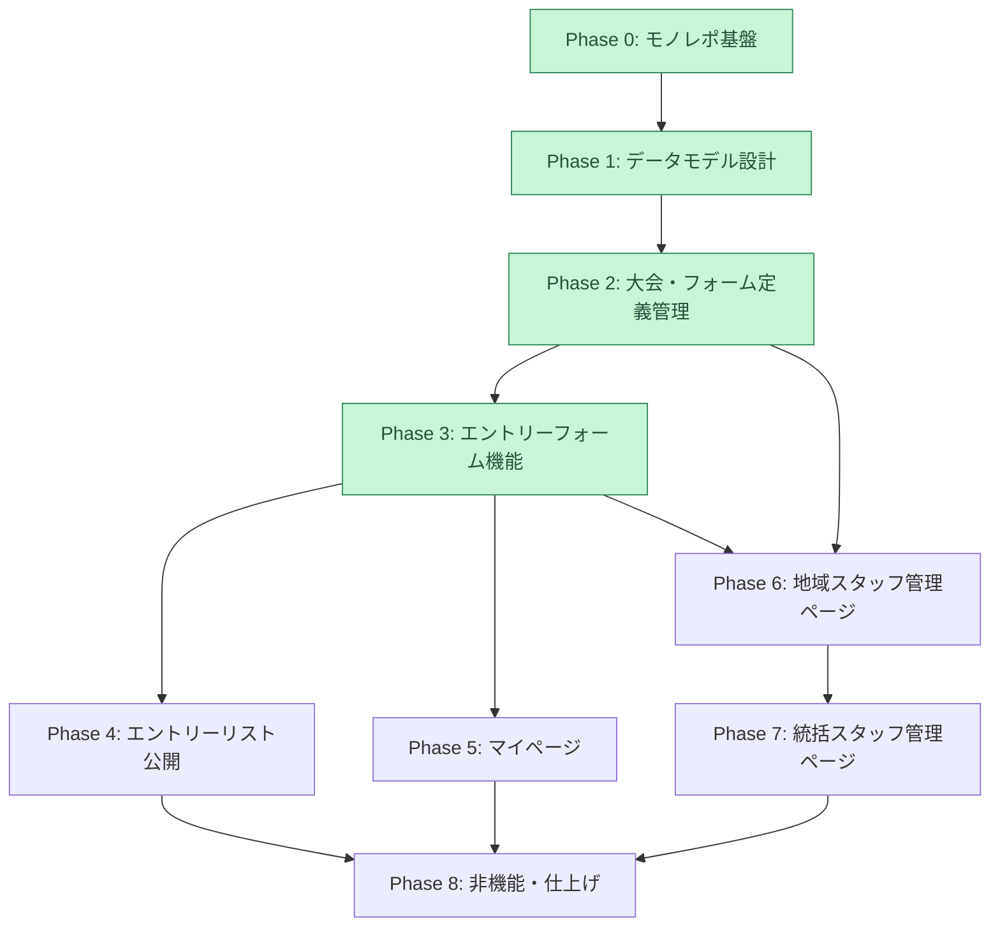
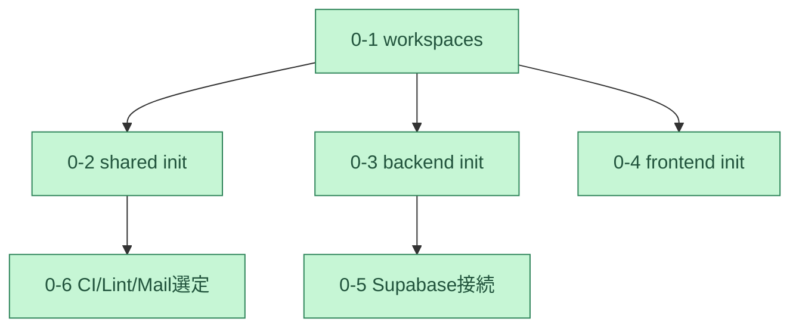
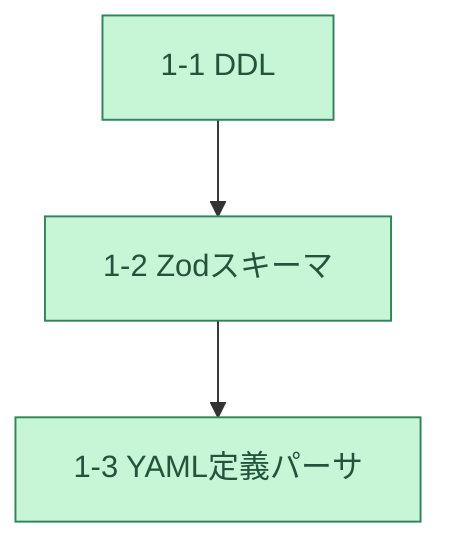
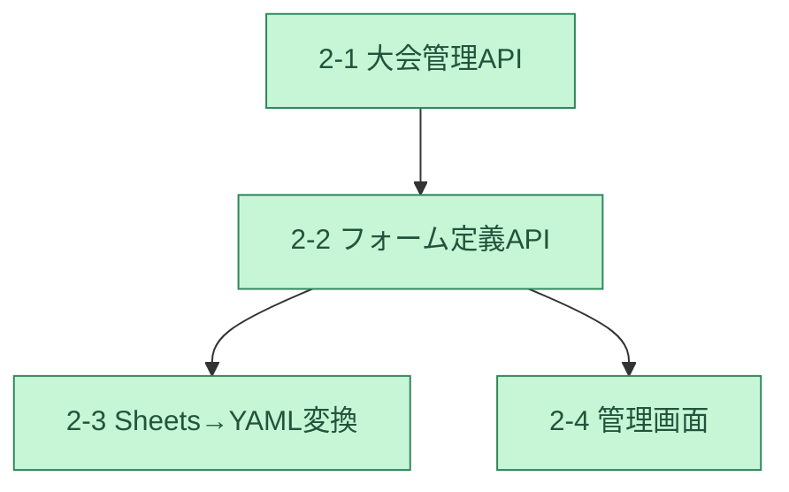
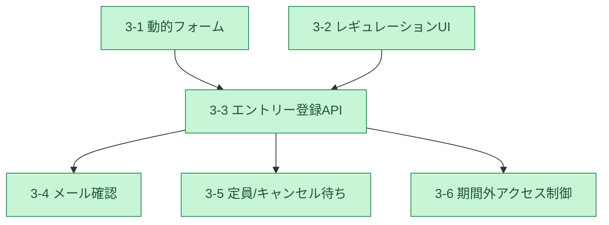
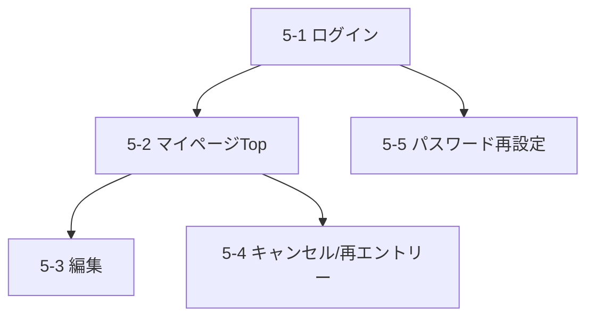
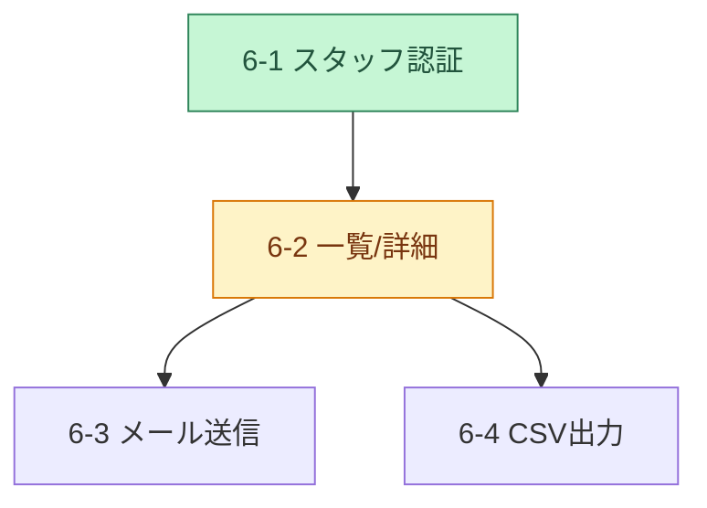

# 地域クイズ最強位・新人王共通エントリーフォーム 実装タスクリスト

## Overview

`requirements.md` の要件を、`CLAUDE.md` に定義された技術構成(Bun workspaces + Hono/Cloudflare Workers + SvelteKit + Supabase)に基づいて実装するためのタスクリストです。現時点(2026-08-23)ではコードは未着手のため、Phase 0 でモノレポの土台を作るところから始めます。

データモデルの設計方針(このタスクリスト全体で前提とする内容):

- **地域(region)** の下に **大会(tournament)** があり、大会は「地域 × 大会種別(最強位 / 新人王)」の組で一意に決まる。
- **参加者アカウント(participant)** は「メールアドレス + パスワード」で識別され、1つの地域にひもづく(地域をまたいだ参加ができないため)。同じ地域内であれば、同じ participant が複数の大会(最強位・新人王)に entry を持てる。
- **エントリー(entry)** は participant × tournament の組ごとに1件。ステータスは `pending_verification`(メール確認待ち) → `confirmed`(確定) / `waitlisted`(キャンセル待ち) → `cancelled`(キャンセル済み)と遷移する。
- **フォーム項目定義** は tournament ごとに YAML で定義し、DB(`form_field_defs` テーブル)に展開して保存する。フロントエンドはこの定義を読んでフォームを動的生成する。
- **レギュレーション** は tournament ごとに複数定義でき、条件によっては「優先エントリー期間」を持つ。優先期間中は、対象レギュレーションを満たす参加者のみがエントリーできる。
- メール送信サービス・パスワードハッシュ方式は Cloudflare Workers(Node.js 実行環境ではない)で動く必要があるため、Web Crypto ベースの実装 / Workers 対応のメール API を選定する。具体的なメール送信サービスの選定は Task 0-6 で決定する前提とする(暫定で Resend を想定)。
- 参加者・スタッフのログインセッションは **JWT**(`hono/jwt` で署名・検証)で管理する。発行した JWT を httpOnly Cookie に格納して送受信し、DB 上にセッションレコードは持たない(Task 5-1, Task 6-1)。

### フェーズ・タスクの概要一覧

* Phase 0: モノレポ基盤構築 ✅完了
  * Task 0-1: Bun workspaces のルート構成 ✅
  * Task 0-2: `packages/shared` の初期構成 ✅
  * Task 0-3: `apps/backend` の Hono + Cloudflare Workers 初期構成 ✅
  * Task 0-4: `apps/frontend` の SvelteKit 初期構成 ✅
  * Task 0-5: Supabase プロジェクト接続とマイグレーション基盤 ✅
  * Task 0-6: Lint / Format / CI とメール送信サービスの選定 ✅
* Phase 1: データモデル設計 ✅完了
  * Task 1-1: Supabase スキーマ定義(DDL マイグレーション) ✅
  * Task 1-2: `packages/shared` の Zod スキーマ定義 ✅
  * Task 1-3: フォーム項目定義 YAML のスキーマとパーサ ✅
* Phase 2: 大会・フォーム定義管理(統括スタッフ) ✅完了
  * Task 2-1: 大会(tournament)管理 API ✅
  * Task 2-2: フォーム定義・レギュレーション登録 API ✅
  * Task 2-3: Google スプレッドシート → YAML 変換ツール ✅
  * Task 2-4: 大会作成・フォーム定義管理画面 ✅
* Phase 3: エントリーフォーム機能(参加者向け) ✅完了
  * Task 3-1: フォーム動的レンダリング ✅
  * Task 3-2: レギュレーション確認 UI と優先期間ロジック ✅
  * Task 3-3: エントリー登録 API ✅
  * Task 3-4: メールアドレス確認フロー ✅
  * Task 3-5: 定員管理とキャンセル待ちロジック ✅
  * Task 3-6: エントリー期間外アクセス制御 ✅
* Phase 4: エントリーリスト公開機能
  * Task 4-1: 公開エントリーリスト API
  * Task 4-2: 公開エントリーリストページ
* Phase 5: 参加者向けマイページ
  * Task 5-1: 参加者ログイン API とセッション管理
  * Task 5-2: マイページ トップ(複数大会のエントリー状況)
  * Task 5-3: エントリー内容編集
  * Task 5-4: エントリーキャンセルと再エントリー
  * Task 5-5: パスワード再設定機能
* Phase 6: 地域スタッフ向け管理ページ
  * Task 6-1: スタッフ認証・権限管理 ✅
  * Task 6-2: エントリー状況一覧・詳細確認
  * Task 6-3: 参加者へのメール送信機能
  * Task 6-4: CSV 出力機能
* Phase 7: 統括スタッフ向け管理ページ
  * Task 7-1: 全地域横断ダッシュボード
* Phase 8: 非機能・仕上げ
  * Task 8-1: E2E テスト整備
  * Task 8-2: デプロイパイプライン整備

## Dependency graph

Phase 間の依存関係と、各 Phase 内の Task 間の依存関係を別の図に分けて示す。

### Phase 間の依存グラフ

凡例: 緑 = 完了、黄 = 次に着手可能(Phase 6 内の一部タスクが次に着手可能)

### Phase 内 Task の依存グラフ

#### Phase 0: モノレポ基盤構築(✅ 完了)

#### Phase 1: データモデル設計(✅ 完了)

#### Phase 2: 大会・フォーム定義管理(✅ 完了)

凡例(以降のフェーズ図も共通): 緑 = 完了、黄 = 次に着手可能

#### Phase 3: エントリーフォーム機能(✅ 完了)

#### Phase 5: マイページ

#### Phase 6: 地域スタッフ管理ページ

## タスク詳細

各タスクの実装内容・コードスニペット・テスト内容は個別ファイルに分割している。

### Phase 0: モノレポ基盤構築 ✅完了

* [Task 0-1: Bun workspaces のルート構成 ✅](tasks/task-0-1.md)
* [Task 0-2: `packages/shared` の初期構成 ✅](tasks/task-0-2.md)
* [Task 0-3: `apps/backend` の Hono + Cloudflare Workers 初期構成 ✅](tasks/task-0-3.md)
* [Task 0-4: `apps/frontend` の SvelteKit 初期構成 ✅](tasks/task-0-4.md)
* [Task 0-5: Supabase プロジェクト接続とマイグレーション基盤 ✅](tasks/task-0-5.md)
* [Task 0-6: Lint / Format / CI とメール送信サービスの選定 ✅](tasks/task-0-6.md)

### Phase 1: データモデル設計 ✅完了

* [Task 1-1: Supabase スキーマ定義(DDL マイグレーション) ✅](tasks/task-1-1.md)
* [Task 1-2: `packages/shared` の Zod スキーマ定義 ✅](tasks/task-1-2.md)
* [Task 1-3: フォーム項目定義 YAML のスキーマとパーサ ✅](tasks/task-1-3.md)

### Phase 2: 大会・フォーム定義管理(統括スタッフ) ✅完了

* [Task 2-1: 大会(tournament)管理 API ✅](tasks/task-2-1.md)
* [Task 2-2: フォーム定義・レギュレーション登録 API ✅](tasks/task-2-2.md)
* [Task 2-3: Google スプレッドシート → YAML 変換ツール ✅](tasks/task-2-3.md)
* [Task 2-4: 大会作成・フォーム定義管理画面 ✅](tasks/task-2-4.md)

### Phase 3: エントリーフォーム機能(参加者向け) ✅完了

* [Task 3-1: フォーム動的レンダリング ✅](tasks/task-3-1.md)
* [Task 3-2: レギュレーション確認 UI と優先期間ロジック ✅](tasks/task-3-2.md)
* [Task 3-3: エントリー登録 API ✅](tasks/task-3-3.md)
* [Task 3-4: メールアドレス確認フロー ✅](tasks/task-3-4.md)
* [Task 3-5: 定員管理とキャンセル待ちロジック ✅](tasks/task-3-5.md)
* [Task 3-6: エントリー期間外アクセス制御 ✅](tasks/task-3-6.md)

### Phase 4: エントリーリスト公開機能

* [Task 4-1: 公開エントリーリスト API](tasks/task-4-1.md)
* [Task 4-2: 公開エントリーリストページ](tasks/task-4-2.md)

### Phase 5: 参加者向けマイページ

* [Task 5-1: 参加者ログイン API とセッション管理](tasks/task-5-1.md)
* [Task 5-2: マイページ トップ(複数大会のエントリー状況)](tasks/task-5-2.md)
* [Task 5-3: エントリー内容編集](tasks/task-5-3.md)
* [Task 5-4: エントリーキャンセルと再エントリー](tasks/task-5-4.md)
* [Task 5-5: パスワード再設定機能](tasks/task-5-5.md)

### Phase 6: 地域スタッフ向け管理ページ

* [Task 6-1: スタッフ認証・権限管理 ✅](tasks/task-6-1.md)
* [Task 6-2: エントリー状況一覧・詳細確認](tasks/task-6-2.md)
* [Task 6-3: 参加者へのメール送信機能](tasks/task-6-3.md)
* [Task 6-4: CSV 出力機能](tasks/task-6-4.md)

### Phase 7: 統括スタッフ向け管理ページ

* [Task 7-1: 全地域横断ダッシュボード](tasks/task-7-1.md)

### Phase 8: 非機能・仕上げ

* [Task 8-1: E2E テスト整備](tasks/task-8-1.md)
* [Task 8-2: デプロイパイプライン整備](tasks/task-8-2.md)
