# 地域クイズ最強位・新人王共通エントリーフォーム 実装タスクリスト

## Overview

`requirements.md` の要件を、`CLAUDE.md` に定義された技術構成(Bun workspaces + Hono/Cloudflare Workers + SvelteKit + Supabase)に基づいて実装するためのタスクリストです。

Phase 0〜8 は実装済みです。2026-08-28 に `requirements.md` と実装を突き合わせたレビューを行い、そこで洗い出した「要件に対して不足している機能」「セキュリティ上の懸念」「効率性の懸念」を Phase 9〜12 として追加しました。Phase 9 は運用開始のブロッカー、Phase 10 は要件との差分、Phase 11 はセキュリティ、Phase 12 は性能です。

Phase 9 以降のタスクファイルに書かれているマイグレーション番号(`0014_...` 以降)は、各タスクを番号順に実施した場合の想定です。実際の着手順に応じて `bun run db:new` が採番する番号に読み替えてください。

データモデルの設計方針(このタスクリスト全体で前提とする内容):

- **地域(region)** の下に **大会(tournament)** があり、大会は「地域 × 大会種別(最強位 / 新人王)」の組で一意に決まる。
- **参加者アカウント(participant)** は「メールアドレス + パスワード」で識別され、1つの地域にひもづく(地域をまたいだ参加ができないため)。同じ地域内であれば、同じ participant が複数の大会(最強位・新人王)に entry を持てる。
- **エントリー(entry)** は participant × tournament の組ごとに1件。ステータスは `pending_verification`(メール確認待ち) → `confirmed`(確定) / `waitlisted`(キャンセル待ち) → `cancelled`(キャンセル済み)と遷移する。
- **フォーム項目定義** は tournament ごとに YAML で定義し、DB(`form_field_defs` テーブル)に展開して保存する。フロントエンドはこの定義を読んでフォームを動的生成する。
- **レギュレーション** は tournament ごとに複数定義でき、条件によっては「優先エントリー期間」を持つ。優先期間中は、対象レギュレーションを満たす参加者のみがエントリーできる。
- メール送信サービス・パスワードハッシュ方式は Cloudflare Workers(Node.js 実行環境ではない)で動く必要があるため、Web Crypto ベースの実装 / Workers 対応のメール API を選定する。具体的なメール送信サービスの選定は Task 0-6 で決定する前提とする(暫定で Resend を想定)。
- 参加者・スタッフのログインセッションは **JWT**(`hono/jwt` で署名・検証)で管理する。発行した JWT を httpOnly Cookie に格納して送受信し、DB 上にセッションレコードは持たない(Task 5-1, Task 6-1)。

### フェーズ・タスクの概要一覧

* Phase 0: モノレポ基盤構築 ✅完了
  * Task 0-1: Bun workspaces のルート構成 ✅
  * Task 0-2: `packages/shared` の初期構成 ✅
  * Task 0-3: `apps/backend` の Hono + Cloudflare Workers 初期構成 ✅
  * Task 0-4: `apps/frontend` の SvelteKit 初期構成 ✅
  * Task 0-5: Supabase プロジェクト接続とマイグレーション基盤 ✅
  * Task 0-6: Lint / Format / CI とメール送信サービスの選定 ✅
* Phase 1: データモデル設計 ✅完了
  * Task 1-1: Supabase スキーマ定義(DDL マイグレーション) ✅
  * Task 1-2: `packages/shared` の Zod スキーマ定義 ✅
  * Task 1-3: フォーム項目定義 YAML のスキーマとパーサ ✅
* Phase 2: 大会・フォーム定義管理(統括スタッフ) ✅完了
  * Task 2-1: 大会(tournament)管理 API ✅
  * Task 2-2: フォーム定義・レギュレーション登録 API ✅
  * Task 2-3: Google スプレッドシート → YAML 変換ツール ✅
  * Task 2-4: 大会作成・フォーム定義管理画面 ✅
* Phase 3: エントリーフォーム機能(参加者向け) ✅完了
  * Task 3-1: フォーム動的レンダリング ✅
  * Task 3-2: レギュレーション確認 UI と優先期間ロジック ✅
  * Task 3-3: エントリー登録 API ✅
  * Task 3-4: メールアドレス確認フロー ✅
  * Task 3-5: 定員管理とキャンセル待ちロジック ✅
  * Task 3-6: エントリー期間外アクセス制御 ✅
* Phase 4: エントリーリスト公開機能 ✅完了
  * Task 4-1: 公開エントリーリスト API ✅
  * Task 4-2: 公開エントリーリストページ ✅
* Phase 5: 参加者向けマイページ ✅完了
  * Task 5-1: 参加者ログイン API とセッション管理 ✅
  * Task 5-2: マイページ トップ(複数大会のエントリー状況) ✅
  * Task 5-3: エントリー内容編集 ✅
  * Task 5-4: エントリーキャンセルと再エントリー ✅
  * Task 5-5: パスワード再設定機能 ✅
* Phase 6: 地域スタッフ向け管理ページ ✅完了
  * Task 6-1: スタッフ認証・権限管理 ✅
  * Task 6-2: エントリー状況一覧・詳細確認 ✅
  * Task 6-3: 参加者へのメール送信機能 ✅
  * Task 6-4: CSV 出力機能 ✅
* Phase 7: 統括スタッフ向け管理ページ ✅完了
  * Task 7-1: 全地域横断ダッシュボード ✅
* Phase 8: 非機能・仕上げ ✅完了
  * Task 8-1: E2E テスト整備 ✅(#74 でブラウザ操作の UI レベルに引き上げ済み)
  * Task 8-2: デプロイパイプライン整備 ✅(`/api/*` の Worker route の有効化は Task 9-5 / #101 に分離)
* Phase 9: 管理機能の欠落解消(運用ブロッカー) 🚧進行中
  * Task 9-1: レギュレーション登録・編集 API
  * Task 9-2: 地域(regions)管理 API ✅
  * Task 9-3: スタッフアカウント管理 API
  * Task 9-4: 統括スタッフ向け管理画面(地域・レギュレーション・スタッフ)
  * Task 9-5: `/api/*` の Worker route 有効化(#101)
* Phase 10: 要件との差分の解消 🚧未着手
  * Task 10-1: 地域ごとの「最強位・新人王 重複参加」可否の制御
  * Task 10-2: レギュレーションの複数選択対応(要確認)
  * Task 10-3: ログアウト機能(参加者・スタッフ)
  * Task 10-4: 一斉メールの Cloudflare Queues 化(80 名上限の撤廃)
  * Task 10-5: エントリー期間外アクセス制御をバックエンドにも実装する
* Phase 11: セキュリティ強化 🚧未着手
  * Task 11-1: レート制限と Turnstile(ログイン・エントリー・再設定要求)
  * Task 11-2: エントリー登録のメールアドレス列挙対策
  * Task 11-3: スタッフセッションの失効手段
  * Task 11-4: パスワードハッシュの強化とアルゴリズム移行の余地
  * Task 11-5: CSRF 対策の明示化とセキュリティヘッダ
  * Task 11-6: 認可の抜け漏れを構造的に防ぐ(ルート網羅テスト)
  * Task 11-7: 軽微な堅牢化(入力長上限・メール本文・robots.txt)
* Phase 12: 性能・効率の改善 🚧未着手
  * Task 12-1: 大会取得まわりの DB 往復削減
  * Task 12-2: 一覧 API のページネーション
  * Task 12-3: 公開エントリーリストのキャッシュ
  * Task 12-4: 不足しているインデックスの追加

## Dependency graph

Phase 間の依存関係と、各 Phase 内の Task 間の依存関係を別の図に分けて示す。

### Phase 間の依存グラフ

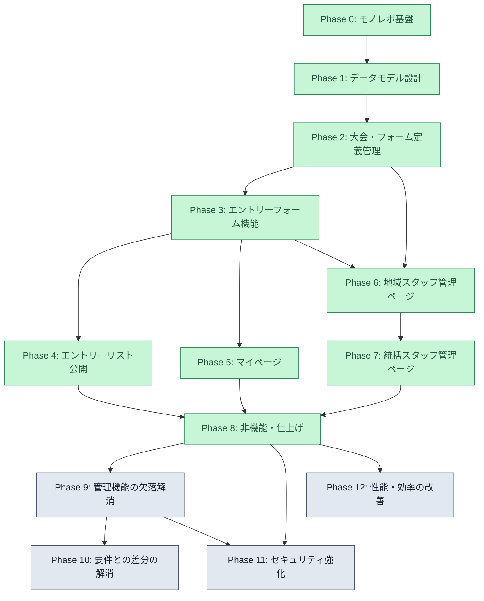

凡例: 緑 = 完了、黄 = 進行中、灰 = 未着手。Phase 0〜8 は完了済み。Phase 9〜12 は 2026-08-28 のレビューで洗い出した積み残しで、Phase 9(運用ブロッカー)が最優先。Phase 11・12 は Phase 9 の完了を待たずに着手できるものが多いが、Task 11-3 は Task 9-3、Task 10-1/10-2 は Task 9-1/9-2 に依存する。

### Phase 内 Task の依存グラフ

#### Phase 0: モノレポ基盤構築(✅ 完了)

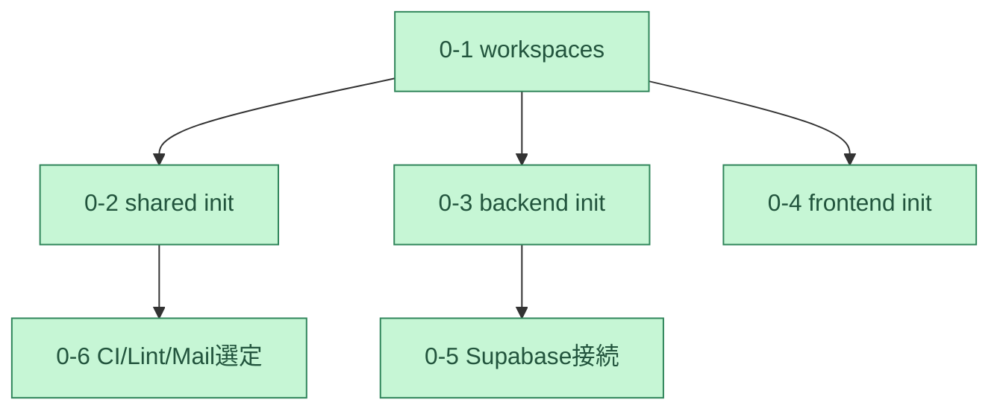

#### Phase 1: データモデル設計(✅ 完了)

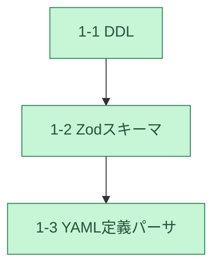

#### Phase 2: 大会・フォーム定義管理(✅ 完了)

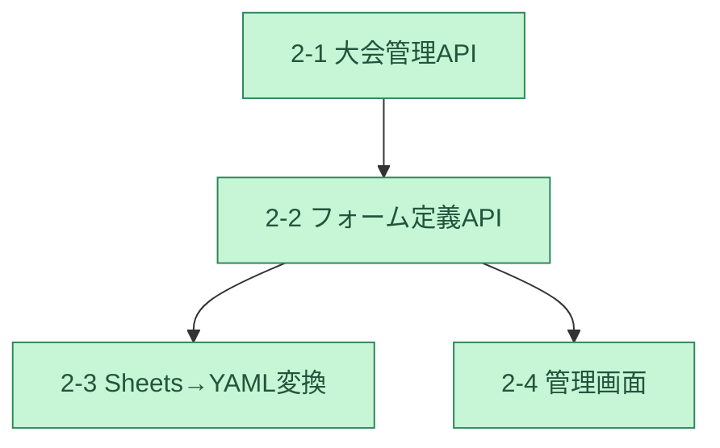

凡例(以降のフェーズ図も共通): 緑 = 完了、黄 = 次に着手可能

#### Phase 3: エントリーフォーム機能(✅ 完了)

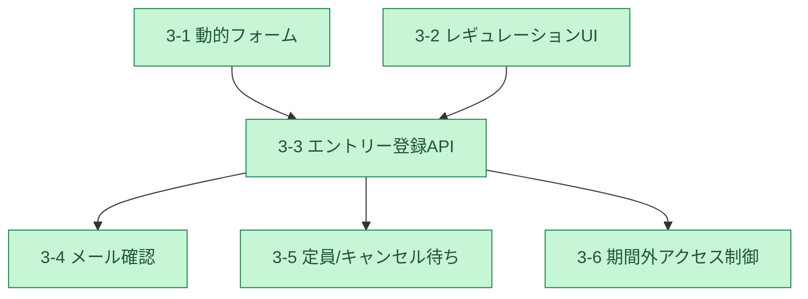

#### Phase 4: エントリーリスト公開機能(✅ 完了)

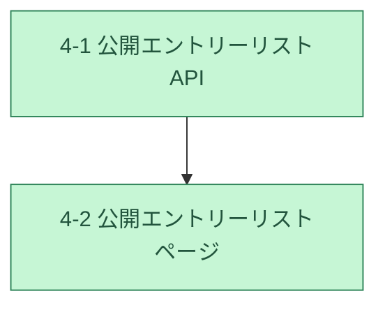

#### Phase 5: マイページ(✅ 完了)

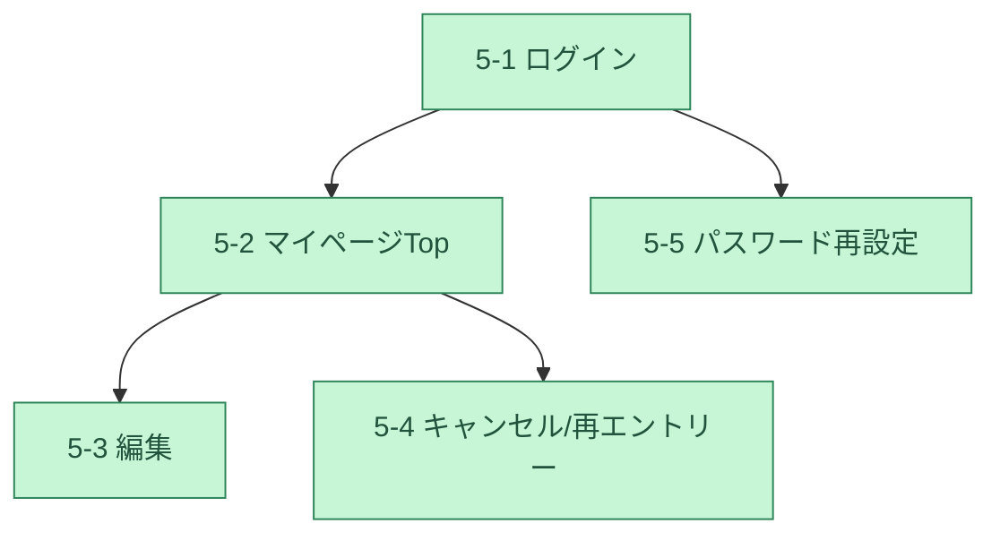

#### Phase 6: 地域スタッフ管理ページ(✅ 完了)

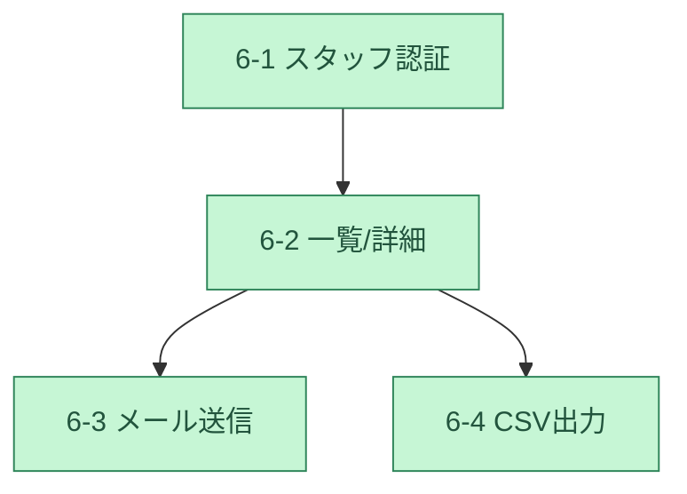

#### Phase 9: 管理機能の欠落解消(🚧 進行中)

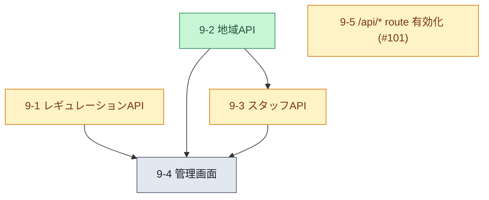

9-1・9-2・9-5 は互いに独立で、並行して着手できる。9-5 だけはドメイン取得という外部要因が前提。

#### Phase 10: 要件との差分の解消(🚧 未着手)

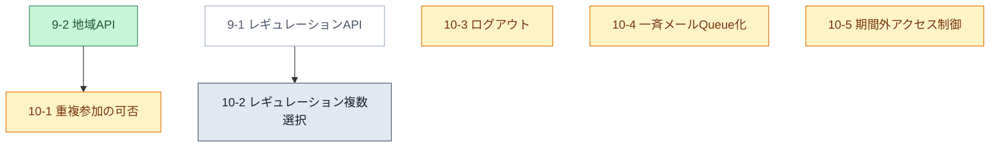

白い枠は Phase 9 のタスク(前提)。10-3・10-4・10-5 は Phase 9 を待たずに着手できる。10-2 は要件の読み方の確認が先。

#### Phase 11: セキュリティ強化(🚧 未着手)

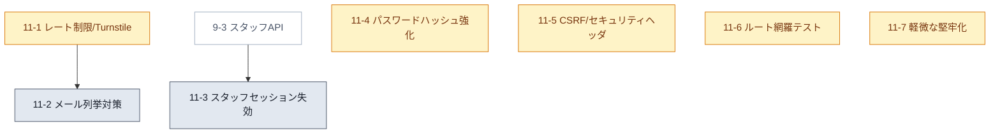

11-1 → 11-2 の順序は必須(応答を統一しても、レート制限が無ければ処理時間差で列挙できるため)。他は独立。

#### Phase 12: 性能・効率の改善(🚧 未着手)

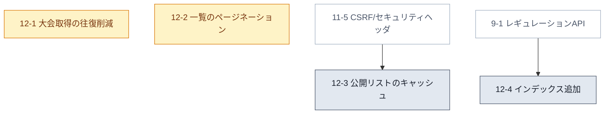

12-3 が 11-5 に依存するのは、キャッシュ可能にする前に「キャッシュしてはいけない画面」を閉じておく必要があるため。12-4 は 9-1 が張るインデックスと重複しないことの確認を含む。

## タスク詳細

各タスクの実装内容・コードスニペット・テスト内容は個別ファイルに分割している。

### Phase 0: モノレポ基盤構築 ✅完了

* [Task 0-1: Bun workspaces のルート構成 ✅](tasks/task-0-1.md)
* [Task 0-2: `packages/shared` の初期構成 ✅](tasks/task-0-2.md)
* [Task 0-3: `apps/backend` の Hono + Cloudflare Workers 初期構成 ✅](tasks/task-0-3.md)
* [Task 0-4: `apps/frontend` の SvelteKit 初期構成 ✅](tasks/task-0-4.md)
* [Task 0-5: Supabase プロジェクト接続とマイグレーション基盤 ✅](tasks/task-0-5.md)
* [Task 0-6: Lint / Format / CI とメール送信サービスの選定 ✅](tasks/task-0-6.md)

### Phase 1: データモデル設計 ✅完了

* [Task 1-1: Supabase スキーマ定義(DDL マイグレーション) ✅](tasks/task-1-1.md)
* [Task 1-2: `packages/shared` の Zod スキーマ定義 ✅](tasks/task-1-2.md)
* [Task 1-3: フォーム項目定義 YAML のスキーマとパーサ ✅](tasks/task-1-3.md)

### Phase 2: 大会・フォーム定義管理(統括スタッフ) ✅完了

* [Task 2-1: 大会(tournament)管理 API ✅](tasks/task-2-1.md)
* [Task 2-2: フォーム定義・レギュレーション登録 API ✅](tasks/task-2-2.md) — 実装されたのは `form_field_defs` の同期のみ。表題にあるレギュレーションの書き込み API は未実装で、[Task 9-1](tasks/task-9-1.md) に切り出した
* [Task 2-3: Google スプレッドシート → YAML 変換ツール ✅](tasks/task-2-3.md)
* [Task 2-4: 大会作成・フォーム定義管理画面 ✅](tasks/task-2-4.md)

### Phase 3: エントリーフォーム機能(参加者向け) ✅完了

* [Task 3-1: フォーム動的レンダリング ✅](tasks/task-3-1.md)
* [Task 3-2: レギュレーション確認 UI と優先期間ロジック ✅](tasks/task-3-2.md)
* [Task 3-3: エントリー登録 API ✅](tasks/task-3-3.md)
* [Task 3-4: メールアドレス確認フロー ✅](tasks/task-3-4.md)
* [Task 3-5: 定員管理とキャンセル待ちロジック ✅](tasks/task-3-5.md)
* [Task 3-6: エントリー期間外アクセス制御 ✅](tasks/task-3-6.md)

### Phase 4: エントリーリスト公開機能 ✅完了

* [Task 4-1: 公開エントリーリスト API ✅](tasks/task-4-1.md)
* [Task 4-2: 公開エントリーリストページ ✅](tasks/task-4-2.md)

### Phase 5: 参加者向けマイページ ✅完了

* [Task 5-1: 参加者ログイン API とセッション管理 ✅](tasks/task-5-1.md)
* [Task 5-2: マイページ トップ(複数大会のエントリー状況) ✅](tasks/task-5-2.md)
* [Task 5-3: エントリー内容編集 ✅](tasks/task-5-3.md)
* [Task 5-4: エントリーキャンセルと再エントリー ✅](tasks/task-5-4.md)
* [Task 5-5: パスワード再設定機能 ✅](tasks/task-5-5.md)

### Phase 6: 地域スタッフ向け管理ページ ✅完了

* [Task 6-1: スタッフ認証・権限管理 ✅](tasks/task-6-1.md)
* [Task 6-2: エントリー状況一覧・詳細確認 ✅](tasks/task-6-2.md)
* [Task 6-3: 参加者へのメール送信機能 ✅](tasks/task-6-3.md)
* [Task 6-4: CSV 出力機能 ✅](tasks/task-6-4.md)

### Phase 7: 統括スタッフ向け管理ページ ✅完了

* [Task 7-1: 全地域横断ダッシュボード ✅](tasks/task-7-1.md)

### Phase 8: 非機能・仕上げ ✅完了

* [Task 8-1: E2E テスト整備 ✅](tasks/task-8-1.md)
* [Task 8-2: デプロイパイプライン整備 ✅](tasks/task-8-2.md) — ワークフローと環境定義は完了。`/api/*` を backend Worker へ振り分ける route の有効化は実ドメイン取得待ちのため #101 に分離した(`docs/supabase-deployment.md` 6.4)。[Task 9-5](tasks/task-9-5.md) として起票済み

### Phase 9: 管理機能の欠落解消(運用ブロッカー) 🚧進行中

要件に定義がありながら API も画面も無く、運用開始を塞いでいるもの。

* [Task 9-1: レギュレーション登録・編集 API](tasks/task-9-1.md) — 優先エントリー期間を含め、現状は Supabase を直接操作しないと設定できない
* [Task 9-2: 地域(regions)管理 API ✅](tasks/task-9-2.md) — 地域が作れないと大会も作れない。`GET / POST / PATCH /api/regions` を追加済み
* [Task 9-3: スタッフアカウント管理 API](tasks/task-9-3.md) — スタッフの発行にアプリのコード実行(パスワードハッシュ生成)が要る状態の解消
* [Task 9-4: 統括スタッフ向け管理画面(地域・レギュレーション・スタッフ)](tasks/task-9-4.md) — `/admin/*` のサーバ側ガード追加を含む
* [Task 9-5: `/api/*` の Worker route 有効化(#101)](tasks/task-9-5.md) — 本番で CSV ダウンロードと `/admin` のクライアント側 API 呼び出しが 404 になっている

### Phase 10: 要件との差分の解消 🚧未着手

実装はあるが `requirements.md` の記述と食い違っている、あるいは要件が求める運用に届いていないもの。

* [Task 10-1: 地域ごとの「最強位・新人王 重複参加」可否の制御](tasks/task-10-1.md) — 現在は全地域で重複参加できてしまう
* [Task 10-2: レギュレーションの複数選択対応](tasks/task-10-2.md) — 「どれか一つを最低限でも満たす」の読み方を統括スタッフに確認してから着手する
* [Task 10-3: ログアウト機能(参加者・スタッフ)](tasks/task-10-3.md) — 現在セッションを終わらせる手段が無い
* [Task 10-4: 一斉メールの Cloudflare Queues 化](tasks/task-10-4.md) — 1 リクエスト 80 名の上限を外す。課金判断を伴う
* [Task 10-5: エントリー期間外アクセス制御をバックエンドにも実装する](tasks/task-10-5.md) — 現在はフロントの `load` のみで、スコープ判定も緩い

### Phase 11: セキュリティ強化 🚧未着手

* [Task 11-1: レート制限と Turnstile](tasks/task-11-1.md) — 総当たり・メール爆撃・CPU 枯渇のいずれにも今は無防備
* [Task 11-2: エントリー登録のメールアドレス列挙対策](tasks/task-11-2.md) — ログインと再設定要求では潰してある穴が、ここだけ空いている
* [Task 11-3: スタッフセッションの失効手段](tasks/task-11-3.md) — 参加者側にはある仕組みがスタッフ側に無い
* [Task 11-4: パスワードハッシュの強化とアルゴリズム移行の余地](tasks/task-11-4.md) — 現在の保存形式ではパラメータを一度も変えられない
* [Task 11-5: CSRF 対策の明示化とセキュリティヘッダ](tasks/task-11-5.md) — 今の安全性が暗黙の前提に依存している状態の解消
* [Task 11-6: 認可の抜け漏れを構造的に防ぐ(ルート網羅テスト)](tasks/task-11-6.md) — 認可が 100% ミドルウェア頼みであることへの手当て
* [Task 11-7: 軽微な堅牢化(入力長上限・メール本文・robots.txt)](tasks/task-11-7.md)

### Phase 12: 性能・効率の改善 🚧未着手

* [Task 12-1: 大会取得まわりの DB 往復削減](tasks/task-12-1.md) — ほぼ全ページの `load` の入口が 2 クエリになっている
* [Task 12-2: 一覧 API のページネーション](tasks/task-12-2.md) — 公開リストもスタッフ一覧も現在は全件返す
* [Task 12-3: 公開エントリーリストのキャッシュ](tasks/task-12-3.md) — `Cache-Control` がコードベースに 1 件も無い
* [Task 12-4: 不足しているインデックスの追加](tasks/task-12-4.md)
